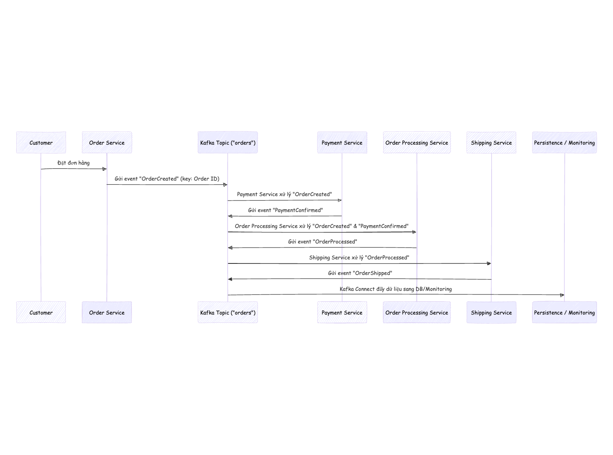

### 1. Giới thiệu về Apache Kafka
Apache Kafka là gì?

- Kafka là một nền tảng xử lý luồng (streaming platform) phân tán, được phát triển bởi LinkedIn và sau đó trở thành một dự án mã nguồn mở của Apache.
- Mục tiêu chính của Kafka là cung cấp giải pháp thu thập, lưu trữ và xử lý các luồng dữ liệu theo thời gian thực với hiệu suất cao và khả năng mở rộng vượt trội.

Ứng dụng thực tế của Kafka:

- Thu thập log: Tập trung log từ các hệ thống khác nhau, xử lý và phân tích log theo thời gian thực.
- Phân tích dữ liệu thời gian thực: Xây dựng pipeline xử lý dữ liệu từ các nguồn sự kiện (clickstream, giao dịch, cảm biến IoT, …).
- Hệ thống thông báo (notification system): Giao tiếp bất đồng bộ giữa các microservices, đảm bảo độ tin cậy trong việc truyền tải thông điệp.
- Pipeline tích hợp dữ liệu: Kết nối và đồng bộ dữ liệu giữa các hệ thống, ví dụ như từ cơ sở dữ liệu đến kho dữ liệu lớn (data warehouse).
 

### 2. Kiến trúc và Các Thành Phần Chính
2.1. Kiến trúc tổng quan
Thằng Kafka này nó chơi kiểu publish-subscribe :  

- Producer: Gửi tin nhắn vào Kafka, như bưu tá chăm chỉ.  
- Broker: Máy chủ lưu trữ, xử lý tin nhắn – nhiều broker thành một cụm siêu khỏe.  
- Topic: “Hộp thư” chứa tin nhắn, phân loại cho dễ quản lý.  
- Partition: Chia nhỏ topic để xử lý song song, tăng tốc độ.  
- Consumer: Đọc tin nhắn từ topic, kiểu khách nhận thư.  
- Consumer Group: Đội consumer chia nhau đọc, đảm bảo không ai nhận trùng thư.

### 2.2. Chi tiết thành phần  
- Broker: Lưu dữ liệu, mỗi thằng quản vài partition. Cụm Kafka càng đông broker càng bền.  
- Topic & Partition: Topic là danh mục, partition là “kệ hàng” trong đó. Nhiều partition = nhiều consumer làm cùng lúc, nhưng tin nhắn trong một partition vẫn có thứ tự.  
- Producer: Gửi tin, chọn partition bằng key để giữ thứ tự. Config hay dùng: acks (xác nhận gửi), batch.size (gom tin gửi một lần), compression (nén cho nhẹ).  
- Consumer & Group: Consumer đọc solo hoặc theo nhóm. Nhóm thì chia tải, mỗi tin chỉ một đứa xử lý.  
- Replication: Sao chép partition qua nhiều broker, lỡ một thằng chết thì vẫn có bản sao cứu nguy.
Mô hình như bên dưới:

### 3. Cấu hình và Quản lý Kafka
3.1. Cấu hình cơ bản
- Broker: Set log.retention.hours (giữ tin bao lâu), num.partitions (mặc định bao nhiêu partition).

- Producer:acks=all cho chắc chắn, retries để thử lại khi lỗi, compression=gzip tiết kiệm băng thông.

- Consumer:auto.offset.reset=earliest để đọc từ đầu, group.id để quản nhóm.

3.2. Quản lý
- Replication & ISR: Đảm bảo bản sao đồng bộ với leader, tăng độ tin cậy.
- Retention: Giữ tin 7 ngày hoặc theo dung lượng, quá thì xóa.
- Zookeeper vs KRaft: Trước dùng Zookeeper, giờ Kafka mới chơi KRaft tự quản metadata – nhẹ đầu hơn.

 

### 4. Xử lý Luồng Dữ liệu và Ứng dụng của Kafka
4.1. Kafka Streams
- Kafka Streams là gì?
    - Thư viện xử lý luồng ngay trong Kafka: lọc, gộp, phân tích real-time. Ví dụ: Theo dõi click người dùng, đếm lượt xem livestream liền tay.
    - Hỗ trợ các thao tác như filter, map, reduce, join… cho các ứng dụng thời gian thực.
- Ứng dụng:
    - Xây dựng ứng dụng phân tích log, theo dõi hoạt động người dùng, xử lý dữ liệu giao dịch, …
    - Tích hợp chặt chẽ với Kafka, giúp đơn giản hoá việc xử lý dữ liệu trong luồng mà không cần hệ thống bên ngoài phức tạp.

4.2. Kafka Connect
- Kafka Connect là gì?
    - Một framework để tích hợp dữ liệu giữa Kafka và các hệ thống bên ngoài như cơ sở dữ liệu, kho dữ liệu, hệ thống lưu trữ hoặc các dịch vụ đám mây. Tích hợp nhanh, khỏi code mệt.  
    - Hỗ trợ cả nguồn (source connector) để đưa dữ liệu vào Kafka và bộ đẩy (sink connector) để xuất dữ liệu từ Kafka sang hệ thống khác.
- Ưu điểm:
    - Giảm thiểu việc phải viết code tích hợp tùy chỉnh.
    - Dễ dàng cấu hình và mở rộng theo nhu cầu tích hợp dữ liệu.
### 5. Các Vấn Đề Nâng Cao và Best Practices
5.1. Exactly-Once Semantics và Idempotency
- Exactly-Once Processing:
    - Mục tiêu là đảm bảo mỗi message được xử lý chính xác một lần, tránh trường hợp xử lý lặp lại do lỗi mạng hoặc sự cố hệ thống.
    - Kafka cung cấp tính năng “idempotent producer” và các giao thức commit offset để hỗ trợ chế độ này.
- Idempotency:
    - Thiết kế producer và consumer sao cho việc gửi lại message không gây ra việc xử lý trùng lặp hay lỗi logic.
    - Các chiến lược như kiểm tra khóa duy nhất, sử dụng transaction để đảm bảo tính nhất quán.

5.2. Tối ưu hóa hiệu suất
- Producer Tuning:
    - Điều chỉnh batch size, linger.ms (thời gian chờ trước khi gửi batch) và compression type để tối ưu throughput.
- Consumer Tuning:
    - Tối ưu số lượng consumer trong group để đảm bảo cân bằng tải, cùng với việc điều chỉnh fetch size và xử lý offset một cách hiệu quả.
- Broker Tuning:
    - Theo dõi và tối ưu cấu hình log retention, segment size và phân bổ tài nguyên cho broker.

5.3. Giám sát và Logging
- Giám sát Cluster:
    - Sử dụng các công cụ như Prometheus và Grafana để theo dõi hiệu suất, số lượng message, độ trễ và trạng thái của broker.
- Logging và Alerting:
    - Tích hợp với ELK Stack (Elasticsearch, Logstash, Kibana) để thu thập và phân tích log, thiết lập các alert khi có dấu hiệu bất thường hoặc lỗi trong hệ thống.
 

### 6. Ứng dụng Kafka trong Kiến trúc Microservices
- Giao tiếp bất đồng bộ: Microservices nhắn nhau qua Kafka, không chờ đợi.  
- Pipeline dữ liệu: Đẩy tin từ service này sang service kia, rồi vào warehouse.  
- Nhất quán: Key theo thứ tự, commit offset chuẩn, không lo mất tin.
 
### 7. Use Case: Xử lý Giao dịch Đơn hàng
Trong một hệ thống thương mại điện tử, việc xử lý giao dịch đơn hàng đòi hỏi tính linh hoạt, khả năng mở rộng và đảm bảo độ tin cậy cao. Apache Kafka có thể được áp dụng để quản lý các luồng sự kiện liên quan đến đơn hàng theo hướng bất đồng bộ. Dưới đây là một quy trình mẫu:

7.1. Quy trình xử lý giao dịch đơn hàng

1. Đặt Hàng (Order Placement):
- Producer: Khi khách hàng đặt đơn hàng, hệ thống sẽ gửi một message với sự kiện “OrderCreated” vào topic có tên “orders”.
- Keying: Message có thể được key theo Order ID để đảm bảo tất cả các sự kiện liên quan đến một đơn hàng được ghi nhận vào cùng một partition, từ đó duy trì thứ tự xử lý.
2. Xác Nhận Thanh Toán (Payment Confirmation):
- Consumer & Producer: Một microservice thanh toán (Payment Service) sẽ tiêu thụ sự kiện “OrderCreated”, tiến hành xử lý thanh toán và sau đó, khi thanh toán thành công, sẽ gửi một message “PaymentConfirmed” vào cùng topic hoặc một topic riêng biệt như “payments”.
- Exactly-Once Semantics & Idempotency: Để đảm bảo mỗi giao dịch chỉ được xử lý một lần, service cần thiết kế idempotency khi gửi lại thông điệp trong trường hợp có lỗi mạng.
3. Xử Lý Đơn Hàng (Order Processing):
- Consumer: Một service xử lý đơn hàng (Order Processing Service) sẽ lắng nghe cả hai sự kiện “OrderCreated” và “PaymentConfirmed” (có thể sử dụng Kafka Streams để kết hợp các luồng dữ liệu này).
- Logic nghiệp vụ: Dựa vào thông tin thanh toán và chi tiết đơn hàng, service cập nhật trạng thái đơn hàng (ví dụ: “Processing” hoặc “Confirmed”) và gửi event “OrderProcessed” vào một topic chuyên dụng.
4. Giao Hàng (Shipping):
- Consumer: Service giao hàng (Shipping Service) nhận thông báo “OrderProcessed” để sắp xếp và thực hiện việc vận chuyển đơn hàng. Sau khi đơn hàng được giao thành công, service sẽ gửi thông báo “OrderShipped”.
5. Cập Nhật và Giám Sát (Monitoring & Persistence):
- Kafka Connect: Các event từ các bước trên có thể được đẩy vào cơ sở dữ liệu hoặc hệ thống lưu trữ khác (ví dụ: Data Warehouse) để lưu trữ lịch sử giao dịch.
- Monitoring: Các công cụ giám sát như Grafana và ELK Stack có thể theo dõi các chỉ số (số lượng message, độ trễ, trạng thái các service) giúp phát hiện và xử lý sự cố kịp thời.

7.2. Ưu điểm của việc áp dụng Kafka trong use case này
- Khả năng mở rộng:

Khi số lượng đơn hàng tăng cao, hệ thống có thể dễ dàng mở rộng bằng cách thêm broker, tăng số partition và mở rộng consumer group.
- Tính bất đồng bộ:

Kafka cho phép xử lý các sự kiện đơn hàng theo cách bất đồng bộ, giúp giảm thiểu sự phụ thuộc trực tiếp giữa các microservice và cải thiện hiệu suất hệ thống.
- Đảm bảo thứ tự và nhất quán:

Sử dụng key theo Order ID đảm bảo rằng các sự kiện liên quan đến một đơn hàng được xử lý theo đúng thứ tự, điều này rất quan trọng trong việc duy trì trạng thái chính xác của đơn hàng.
- Tích hợp dễ dàng:

Với Kafka Connect và Kafka Streams, dữ liệu có thể được chuyển đổi, phân tích và tích hợp vào các hệ thống khác một cách linh hoạt, giúp cập nhật trạng thái đơn hàng theo thời gian thực.

7.3. Ví dụ minh họa
Giả sử một khách hàng đặt một đơn hàng với mã “ORD1234” :
 

Giải thích:

- Order Service: Khi khách hàng đặt hàng, tạo event "OrderCreated" và gửi vào Kafka.
- Payment Service: Nhận event, xử lý thanh toán và xuất event "PaymentConfirmed".
- Order Processing Service: Kết hợp thông tin đặt hàng và thanh toán, cập nhật trạng thái đơn hàng và phát hành event "OrderProcessed".
- Shipping Service: Tiếp nhận thông tin đơn hàng đã xử lý để thực hiện giao hàng, sau đó xuất event "OrderShipped".
- Persistence/Monitoring: Kafka Connect hoặc các công cụ giám sát (Grafana, ELK) thu thập các event để lưu trữ và theo dõi.

Chi tiết ví dụ message payload: 

Bước 1: Service đặt hàng gửi event:
```json
{
  "orderId": "ORD1234",
  "event": "OrderCreated",
  "timestamp": "2025-02-23T10:00:00Z",
  "details": { "customerId": "CUST5678", "items": [ ... ] }
}
```
Bước 2: Payment Service nhận sự kiện “OrderCreated”, xử lý thanh toán, sau đó gửi event:
```json
{
  "orderId": "ORD1234",
  "event": "PaymentConfirmed",
  "timestamp": "2025-02-23T10:01:00Z",
  "paymentDetails": { "amount": 250.00, "paymentMethod": "CreditCard" }
}
```
Bước 3: Order Processing Service kết hợp hai sự kiện trên, cập nhật trạng thái đơn hàng và gửi event “OrderProcessed”:
```json
{
  "orderId": "ORD1234",
  "event": "OrderProcessed",
  "timestamp": "2025-02-23T10:02:00Z",
  "status": "Confirmed"
}
```
Bước 4: Shipping Service nhận event “OrderProcessed”, tiến hành giao hàng và gửi event “OrderShipped” khi hoàn tất:
```json
{
  "orderId": "ORD1234",
  "event": "OrderShipped",
  "timestamp": "2025-02-23T12:00:00Z",
  "shippingDetails": { "carrier": "FastShip", "trackingNumber": "TRACK123" }
}
```

### 8. Thực hành
8.1. Cài đặt Kafka
- Hãy thử cài đặt kafka bằng Docker:
    - Sử dụng Docker Compose để nhanh chóng thiết lập một cluster Kafka gồm Zookeeper (nếu sử dụng phiên bản cũ) và một vài broker.
- Ngoài ra bạn hãy thử cài đặt trực tiếp lên vps:
    - Tải xuống Apache Kafka từ trang chủ, giải nén và cấu hình các file cấu hình như `server.properties`, `zookeeper.properties` (nếu cần).

8.2. Thực hành cơ bản
- Tạo Topic:
    - Sử dụng lệnh `kafka-topics.sh` để tạo topic, thiết lập số lượng partition và replication factor.
- Producer và Consumer Demo:
    - Viết một producer đơn giản bằng Java, Python hoặc ngôn ngữ ưa thích để gửi message vào topic.
    - Viết một consumer để đọc các message từ topic và hiển thị trên console.

### 9. Kết Luận
Kết luận

Apache Kafka là một công cụ mạnh mẽ cho xử lý luồng dữ liệu thời gian thực và tích hợp hệ thống phân tán. Hiểu rõ kiến trúc, các thành phần và cách cấu hình Kafka sẽ giúp bạn:

- Xây dựng các ứng dụng có khả năng mở rộng cao.
- Giảm thiểu rủi ro mất mát dữ liệu.
- Tối ưu hóa hiệu suất và đảm bảo tính nhất quán của hệ thống.

Với use case xử lý giao dịch đơn hàng với Apache Kafka mình đã minh họa rõ ràng cách xây dựng một hệ thống phức tạp và mở rộng được dựa trên mô hình publish-subscribe. Các thành phần như Producer, Consumer, Kafka Streams và Kafka Connect được kết hợp để đảm bảo rằng tất cả các bước xử lý từ đặt hàng, thanh toán, xử lý đến giao hàng đều được thực hiện một cách linh hoạt, có thứ tự và đáng tin cậy.

### 10. Bonus mẹo nhỏ mình thường áp dụng:
1. Tối ưu hóa kích thước batch: Khi làm producer, `đừng để mặc định số lượng message gửi đi quá nhỏ`. Tăng `batch.size` và `linger.ms` lên một chút (ví dụ: `batch.size=16384` và `linger.ms=1`) để gom nhiều message hơn trong một lần gửi. Giảm số lần gọi mạng, tăng throughput, nhưng nhớ cân đối để không delay quá lâu!

2. Theo dõi offset cẩn thận: Làm consumer thì `đừng quên kiểm tra offset commit`. Nếu không commit đúng, gặp crash là dữ liệu xử lý lại từ đầu, mệt lắm. Dùng `enable.auto.commit=falser` ồi tự commit bằng tay sau khi xử lý xong message cho chắc ăn.
3. Chia partition hợp lý: Khi tạo topic, tính số partition dựa trên lượng dữ liệu và consumer group. Quá ít partition thì không tận dụng được parallel processing, mà quá nhiều lại dễ gây overhead. Mình hay `lấy số consumer tối đa nhân lên 2-3 lần` làm điểm khởi đầu.
4. Dùng compression tiết kiệm băng thông: Thêm `compression.type=gzip`(hoặc `snappy` nếu cần tốc độ hơn) vào config producer. Dữ liệu nén lại, gửi nhanh hơn, đặc biệt hữu ích khi message to hoặc mạng không ổn định.
