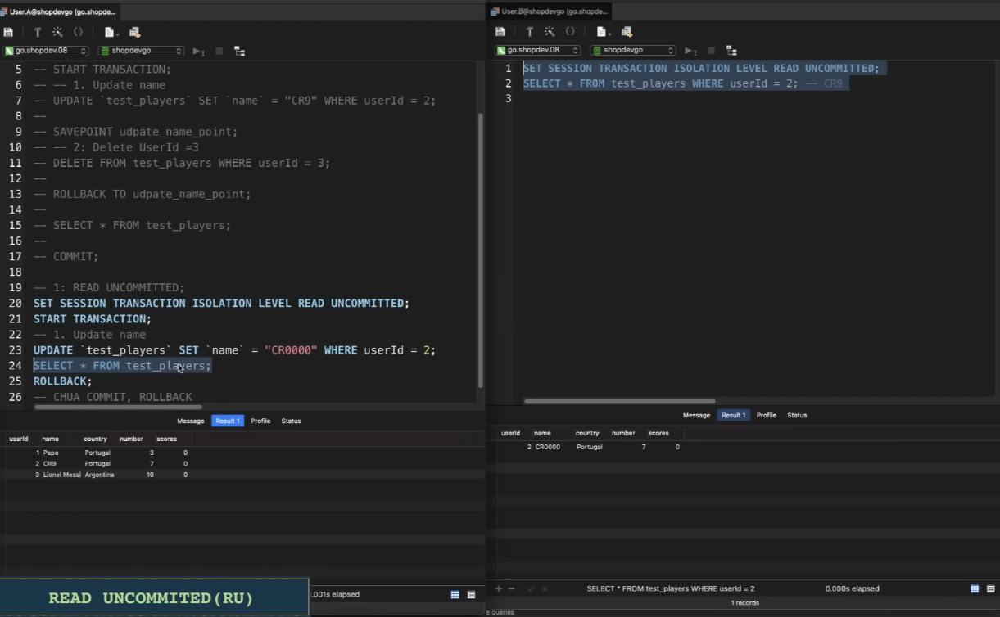
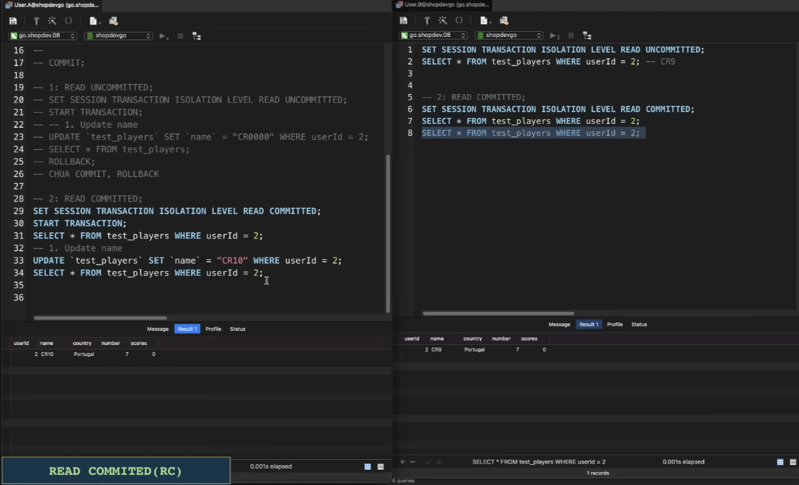
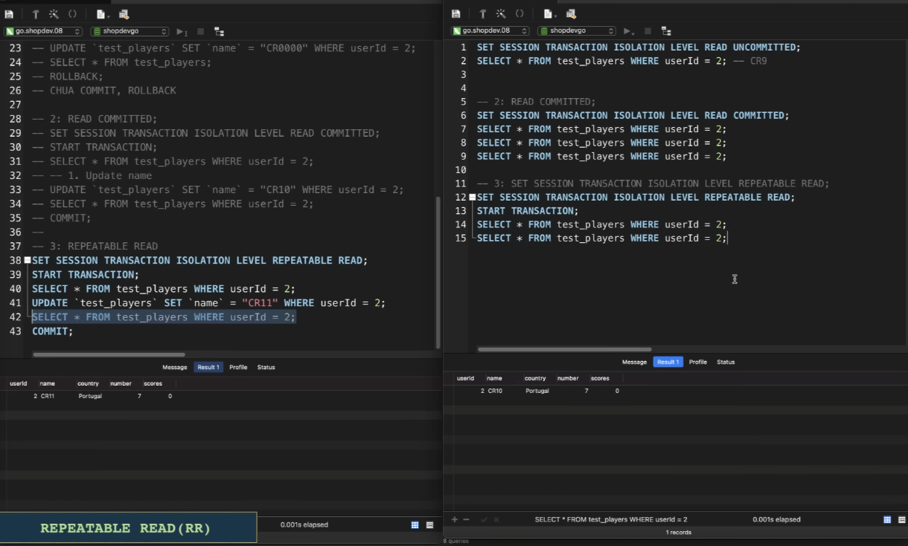
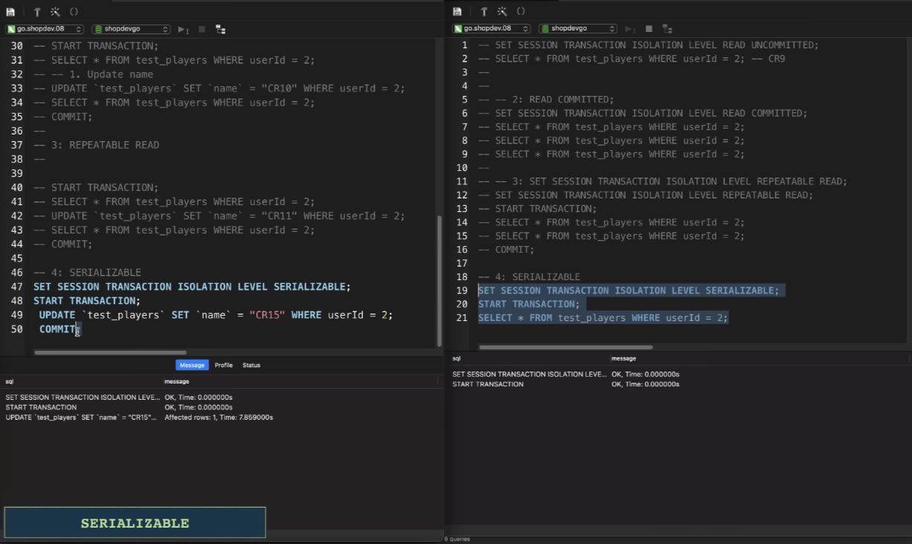

### Trong cơ sở dữ liệu quan hệ (Relational Database), khái niệm quan hệ 1 ngôi, 2 ngôi, 3 ngôi, 4 ngôi liên quan đến số lượng thực thể (entities) tham gia vào một quan hệ (relationship).

| Quan hệ  | Định nghĩa                              | Ví dụ                           |
|----------|--------------------------------------|--------------------------------|
| 1 ngôi   | Một thực thể liên kết với chính nó   | Nhân viên - Quản lý            |
| 2 ngôi   | Quan hệ giữa hai thực thể            | Sinh viên - Lớp học            |
| 3 ngôi   | Quan hệ giữa ba thực thể             | Bác sĩ - Bệnh nhân - Thuốc     |
| 4 ngôi   | Quan hệ giữa bốn thực thể            | Công ty - Dự án - Nhân viên - Vai trò |

**Tóm lại:**
- Quan hệ 1 ngôi (unary): Một thực thể liên kết với chính nó.
- Quan hệ 2 ngôi (binary): Hai thực thể liên kết với nhau (phổ biến nhất).
- Quan hệ 3 ngôi (ternary): Cần bảng trung gian để lưu dữ liệu.
- Quan hệ 4 ngôi (quaternary): Hiếm gặp, nhưng có thể tồn tại.

### Thuộc tính Đa Trị và Đơn Trị trong Cơ Sở Dữ Liệu.
|Loại Thuộc Tính  | Định nghĩa                              | Ví dụ                           |
|----------|--------------------------------------|--------------------------------|
| Đơn trị   | Chỉ có một giá trị tại một thời điểm   | Tên, Ngày Sinh, CMND            |
| Đa trị   | Có thể có nhiều giá trị cho một thực thể           | Số Điện Thoại, Khóa Học |

**Tóm lại:**
- Thuộc tính đơn trị dễ lưu trữ trong bảng quan hệ.
- Thuộc tính đa trị cần tách thành bảng phụ để đảm bảo chuẩn hóa dữ liệu

###  So sánh kiểu dữ liệu CHAR và VARCHAR trong CSDL
| Đặc điểm       | CHAR(n)                         | VARCHAR(n)                       |
|---------------|---------------------------------|----------------------------------|
| **Độ dài**    | Cố định `n` ký tự               | Biến đổi, tối đa `n` ký tự      |
| **Lưu trữ**   | Chiếm đúng `n` ký tự (có thể thêm dấu cách) | Chỉ chiếm đúng số ký tự thực tế |
| **Hiệu suất** | Tìm kiếm nhanh hơn vì độ dài cố định | Có thể chậm hơn do phải tính độ dài |
| **Ứng dụng**  | Mã số, CMND, mã nhân viên       | Tên, địa chỉ, mô tả sản phẩm   |

**Khi nào dùng CHAR và VARCHAR?**
- Dùng CHAR khi:
    - Dữ liệu có độ dài cố định (VD: mã số, mã nhân viên, số CMND).
    - Cần tốc độ truy vấn cao.
- Dùng VARCHAR khi: 
    - Dữ liệu có độ dài thay đổi (VD: tên, mô tả sản phẩm, địa chỉ email).
    - Muốn tiết kiệm bộ nhớ.

**Tóm lại:**
- CHAR phù hợp với dữ liệu ngắn & cố định.
- VARCHAR linh hoạt hơn khi dữ liệu có độ dài thay đổi.


### 4 Mức cô lập trong transaction.
1. Read Uncommited (RU).

- Khi có 2 transaction cùng thực hiện vào 1 bảng, transaction 1 cập nhật bản ghi đó nhưng chưa commit, transaction 2 lại đọc bản ghi đó nhưng lại trả về dữ liệu mà transaction 1 cập nhật mặc dùng chưa commit. Điều này vi phạm nguyên tắc nhất quán trong dữ liệu. Nếu transaction 1 lỗi mà lại rollback lại thì sẽ xảy ra vấn đề sai dữ liệu.
- Hiệu suất rất nhanh.


2. Read commited (RC).
- Khi transaction 2 thực hiện việc đọc bản ghi đó thì phải chờ đợi transaction 1 update và commit thành công thì mới được lấy dữ liệu mới, không thì vẫn lấy ra dữ liệu cũ lúc chưa được update.
- Hiệu xuất chậm hơn vì phải chờ các transaction khác commit


3. Repeatble Read (PR).
- Đọc lại dữ liệu, ngược lại với read commited, kể cả transaction 1 commit nhưng transaction 2 đang đọc mà chưa commit/rollback để kết thức phiên thì vẫn lấy dữ liệu cũ.



4. Serializable.
- Mức cao nhất của database, tuần tụ hóa, các transaction trên cùng 1 table phải hoạt động tuần tự, thằng nào lấy khóa trước sẽ thực hiện trước, thằng nào lấy sau thì phải chờ.
- Hiệu suất giảm mạnh, do chỉ sử lý 1 luồng thực thi trên 1 table, nhưng lại giải quyết được các vấn đề đọc ảo dữ liệu.
- Như ta thấy transaction 2 xoay đợi đến khi nào transaction 1 commit thì mới hoạt động được.


- Nhiều dự án bỏ cơ chế Serializable nên tắt đi để tăng hiệu xuất
- Mặc định của MySQL là Repeatble
```SQL
SHOW VARIABLES LIKE '%isolation%'
```