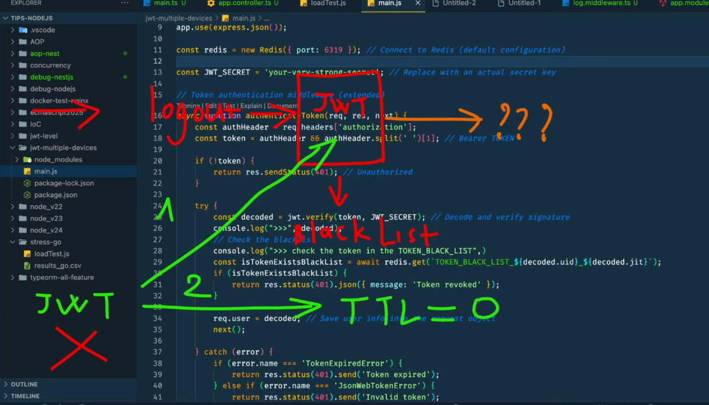

### JWT.
- Nguyên tắc: không được lữ trữ token trong DB.

- Đặt ra vấn đề: Làm sao để đăng xuất một thiết bị khỏi tài khoản sử dụng JWT mà không ảnh hưởng đến các thiết bị khác?
    - Đề xuất phương pháp đơn giản: chỉ lưu trữ user ID trong blacklist. Phương pháp này không hiệu quả khi người dùng đăng nhập trên nhiều thiết bị vì tất cả đều có cùng user ID.
    - Đề xuất phương pháp sử dụng App ID (cho mobile) và Browser ( thư viện Fingerprint) để phân biệt các thiết bị. Tuy nhiên, phương pháp này bị chỉ trích vì phụ thuộc vào bên thứ ba và làm phức tạp quá trình phát triển.
    - Phương pháp tối ưu sử dụng jti:
        - Giới thiệu giải pháp tối ưu: sử dụng jti (JWT ID) – một định danh duy nhất được tạo bởi thư viện UUID cho mỗi token.
        - Giải thích cách sử dụng jti để nhận diện và vô hiệu hóa token cụ thể trên một thiết bị mà không ảnh hưởng đến các thiết bị khác. Chỉ cần lưu trữ jti và user ID trong blacklist.
        - Tóm tắt lại phương pháp sử dụng jti là giải pháp hiệu quả và an toàn. Nhấn mạnh ưu điểm: không vi phạm nguyên tắc không lưu trữ token trong database.

