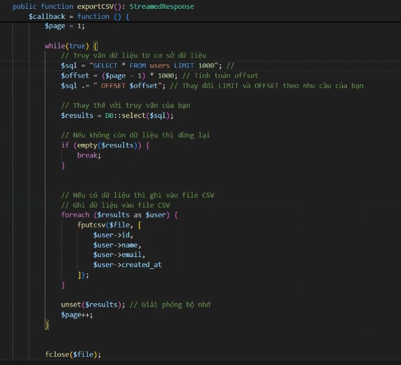
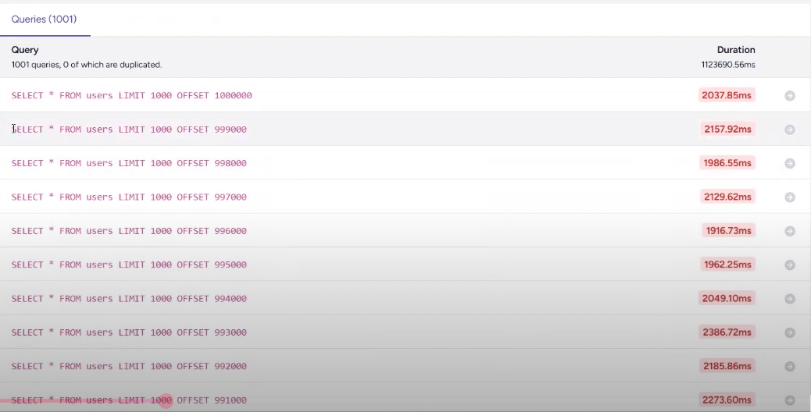
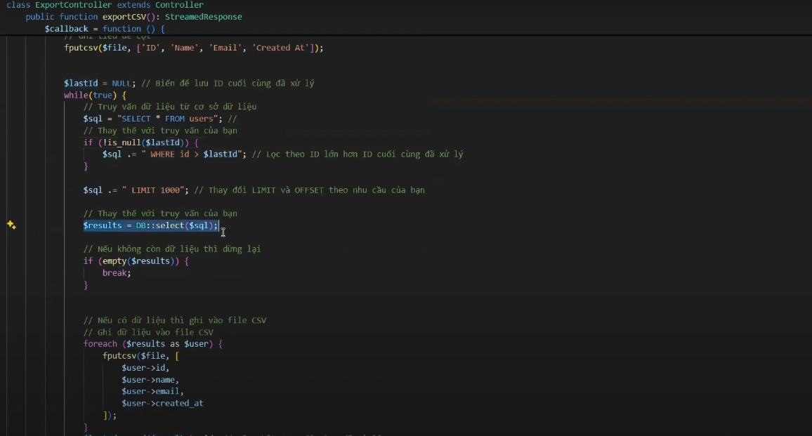

# Việc chúng ta xuất toàn bộ dữ liệu trong DB ra file csv là 1 vấn đề quan trọng. Đối với bảng có hàng triệu dữ liệu việc xuất hết ra khiến dung lượng bộ nhớ cho phép ko đủ.
- Bình thường ta sẽ dùng chunk để lấy dần ra việc này sẽ đỡ bị quá tải bộ nhớ giống như phân trang. Nhưng sẽ rất là lâu vì nó không áp dụng Index


- Như chúng ta thấy ofset càng cao thì thời gian truy vấn càng lâu. Vì nó vẫn phải quét tất cả để đến chỗ ofset.
- Ta có thể dùng index của cột id để tìm nhanh hơn như sau

- Vậy là với việc ta tăng dần tìm id lên việc quét dữ liệu sẽ nhanh hơn rất nhiều
- Nhược điểm id bắt buộc phải primary auto increment. Nếu không ta có thể lợi dụng cột created_at.
- Với bài toán ID không tăng và cần order by thì ta có thể lợi dụng created_at hoặc tạo thêm cột sortable_id :
```PHP
public function scopeChunkByIdDesc(Builder $query, int $count, callable $callback, $column = null, $alias = null)
    {
        $column ??= $query->getModel()->getKeyName(); // Lấy khóa chính mặc định
        $alias ??= $column;

        $lastId = null;

        do {
            $cloneQuery = clone $query; // Clone query để tránh thay đổi bản gốc

            if (!is_null($lastId)) {
                $cloneQuery->where($column, '<', $lastId);
            }

            $results = $cloneQuery->limit($count)->get();
            $countResults = $results->count();

            if ($countResults === 0) {
                break;
            }

            if ($callback($results) === false) {
                return false; // Dừng nếu callback trả về false
            }

            $lastId = data_get($results->last(), $alias);
            info("Last ID: {$lastId}");

            if ($lastId === null) {
                throw new RuntimeException("ChunkById đã bị dừng vì cột [{$alias}] không tồn tại trong kết quả.");
            }

            unset($results);
        } while ($countResults === $count);

        return true;
    }
```