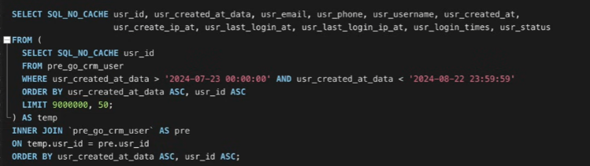

# MYSQL BACKEND: Tối ưu hoá phân trang từ 7s còn 1s với Table có 10.000.000 dữ liệu
- Việc chúng ta lấy hết thông tin các cột của 1 bảng có nhiều bản ghi dù có sử dụng phân trang thì và đánh index thì rất mất nhiều thời gian để query vì chúng ta dùng SELECT *, việc này là hạn chết vì SELECT * sẽ không sử dụng được hiệu năng của index.

việc này đã tốn hết 7s dù chúng ta có đánh index ở cột created_at_date.

- Thay vào đó ta có thể dùng 1 bảng tạm chỉ select ra 1 cột rồi ghép vào điều này sẽ nhanh hơn và sử dụng được index. Đây gọi là facede pattern như trong php, việc dùng bản tạm để xử lý
