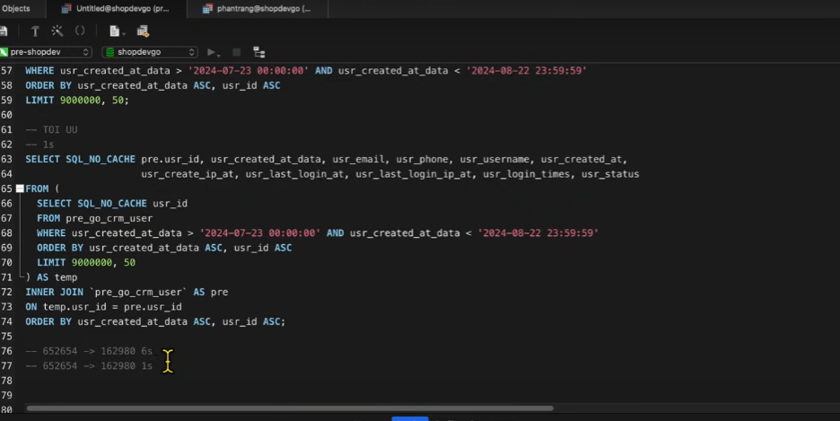
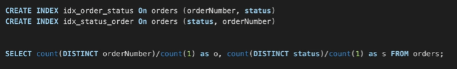

### Tối ưu hiệu suất khi truy vấn
- Đánh index:
    - Index dùng để đánh số thứ tự, thay vì quét toàn bộ khi tìm kiếm (where) thì ta chỉ cần tìm theo index. Ví dụ ta có 1 trồng hồ sơ được xếp theo thứ tự A->Z, khi ta cần tìm hồ sơ có tên gì thì chỉ cần tìm đúng đến tên đó. 
    - Không được đánh index trên 1 cột, mà phải đánh index trên nhiều cột (đánh index trên nhiều cột sẽ tốt hơn 1 cột)
    - Việc tạo index theo thứ tự cột rất quan trong. Ví dụ bạn đánh index trên bảng orders (id, date, user_id, product_id). Nếu ta đánh index (date, user_id) thì khi ta truy vấn `Select * from orders where user_id = 1` thì truy vấn này vẫn quét toàn bộ bản ghi trong bảng. Vậy ta cần phải đánh index là (user_id, date) thì truy vấn đó mới áp dụng được index.
- Dùng Partition:
    -  Partition là ta chia bảng đó thành nhiều bảng con, ví dụ ta chia bảng orders theo tháng, quý hoặc năm. Khi ta tìm kiếm theo date chỉ cần chọc đến partition đó là xong.
    - Nên dùng partition cho bảng có trên 2GB hoặc 10 triệu bản ghi.
- Chia ổ để nâng I/O:
    - Việc chia nơi lưu trữ rất quan trọng, ta có thể chia nơi lưu trữ SQL sang 1 ổ D, nơi lưu trữ data sang ổ E. Điều này sẽ tăng hiệu xuất I/O của hệ thống.
- Dùng DB sharding:
    - Dùng 2 server SQL, 1 cái chỉ đển thực hiện DML (insert, update, delete) còn 1 cái chuyên để lấy ra (select).  
- Kết nối đến database:
    - Để kết nối có 3 bước
        - 1 Tạo kết nối tới MySql
        - 2 Thiết lập kết nối (xác thực)
        - 3 Gửi và xác nhận SQL
        - 4 Ngắt kết nối.
    - Nếu có hàng nghìn request cùng gửi đến thì các bước dùng chung sẽ phải lặp lại đó là bước 1, 2, 4 => Vậy cái nào dùng chung được ta sẽ tạo cái dùng chung đó là connect pool.
- Khi truy vấn ko được sử dụng select * hoặc select hết tất cả các cột trong bảng vì dù chúng ta có đánh index cho điều kiện where đi nữa nó cũng quét toàn bộ. Vậy muốn lấy hết thông tin bảng đó mà vẫn tối ưu ta có thể dùng bảng tạm để lưu chữ như hình sau


---
### FOREIGN KEY
Vấn đề ta có 2 bảng
customers(id, name)
orders(id, customer_id, date)
FOREIGN KEY orders -> customers
Khi ta update ở bảng orders thì nó sẽ quét cả bảng customers để bảo toàn giá trị ở FOREIGN KEY dẫn đến việc update ở bảng order sẽ lâu nếu customers nhiều bản ghi

=> `Cần phải đánh index ở FOREIGN KEY để việc update sẽ nhanh hơn. Lưu ý đối với MySql thì khi FOREIGN KEY thì nó sẽ tự đánh index ở cột đó nếu chúng ta chưa tạo, nếu đánh rồi thì nó sẽ dùng index đó. Đối với SQL server thì việc đó lại không, chúng ta cần phải đánh thủ công`

### Tìm kiếm trong SQL dùng LIKE
- Đối với việc tìm kiếm 1 giá trị trong bảng có 1tr bản ghi mà dùng `LIKE` thì sẽ rất chậm
VD: 
``` sql
SELECT * FROM products where name LIKE '%abc%'; -- tìm rất lâu và sẽ không dùng index kể cả ta có đánh index trên cột name.
SELECT * FROM products where name LIKE 'abc%'; -- tìm tốt hơn và có dùng index.
```
- Ta còn 1 cách tối ưu hơn:
``` SQL
SELECT * from products WHERE match(name) against ('abc') ---chỉ cần có abc là đáp ứng
SELECT * from products WHERE match(name) against ('abc def') ---cái nào có 1 trong 2 ký tự đó đều đc lấy ra
SELECT * from products WHERE match(name) against ('+abc +def') ---cần tìm đúng để có cả 2 ký tự mới lấy ra
```
- Việc dùng như này sẽ tốt hơn like đối với dữ liệu lớn nhưng ko thể so với việc dùng elasticsearch.
- Nhược điểm tìm không chính xác với bài toán nếu mà bắt tìm kiếm kiểu 'toanbn' mà muốn chỉ gõ oan cũng phải ra thì chả có cách nào ngoài LIKE cả.

### Các loại index
- all: chỉ mục ko dùng
- system: chỉ có 1 phần dữ liệu được truy vấn
- const: cho biêt truy vấn SQL index được áp dụng trong truy vấn hiện tại
- range: truy vấn hiện tại tìm kiếm trong khoảng thời gian
- ref: cho biết truy vấn hiện tại đang được thực hiện
- index: chỉ mục đang được thực hiện
=> đánh in dẽ theo công thức bên trái, cái nào cao hơn thì đánh ngoài cùng, cái nào có khác cao hơn thì chọn làm index bên trái.
