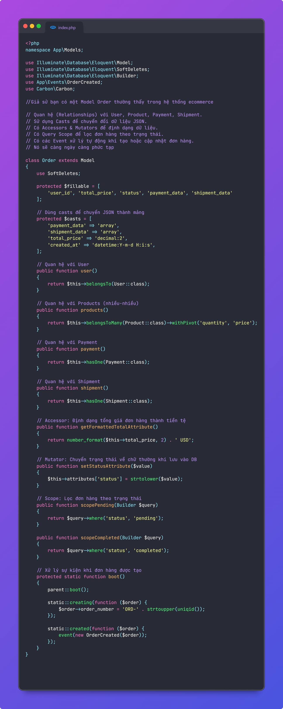
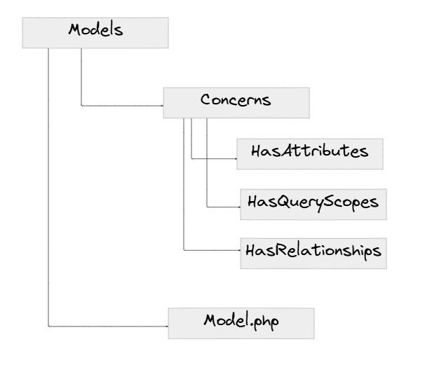
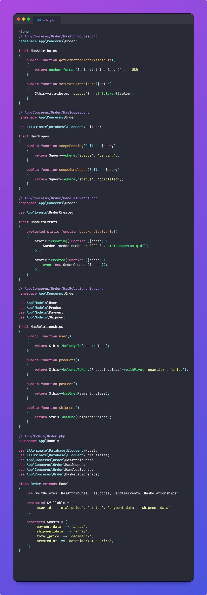

### Cách thức tổ chức Laravel Model cho gọn gàng, dễ maintain và mở rộng.
Code Laravel nhiều năm, (hoặc gọi chung là mô hình MVC đi) thì nhiều ae chắc cũng gặp vấn đề giống mình: Cái Model nó to chà bá luôn (ae có thể quan sát ở hình mô tả). Nào là các properties như fillable, cast, ... cho tới scope, relationship, accessors, mutators, custom builder / collection khắp mọi nơi trong một file Model. Chắc chắn là khi dự án phình to, chúng ta sẽ cần tách các phần này ra nhỏ hơn để tiện quản lý. Nhưng tách như thế nào ?. Bài viết ngắn này mình xin đề xuất các cách đơn giản đó là sử dụng Trait để bạn tổ chức Model cho hợp lý hơn. 
Ý tưởng chính của việc này rất đơn giản:
- Tách các phương thức chung ra các Trait và đặt nó trong thư mục Concerns (Đúng với convention thường thấy của Laravel)
- Tuân thủ các quy tắc naming về chức năng: về cơ bản sẽ luôn có các trait như: HasAttributes, HasQueryScopes, HasRelations, ....
- Bạn tùy ý đặt các Trait vào vị trí phù hợp và tái sử dụng code (Việc nhiều Model chung các traits như HasQueryScopes, HasAttributes hay Has Relations là chuyện rất thường thấy)
- Từ giờ, nếu có thêm một cụm tính năng mới trong Model, bạn có thể tạo thêm các trait trong Concerns cho phù hợp

---
Một ví dụ về một cái Model Order.php thường thấy khi làm app ecommerce. Bạn sẽ có đầy đủ:

1. Quan hệ (Relationships) với User, Product, Payment, Shipment.
2. Sử dụng Casts để chuyển đổi dữ liệu JSON.
3. Có Accessors & Mutators để định dạng dữ liệu.
4. Có Query Scope để lọc đơn hàng theo trạng thái.
5. Có các Event xử lý tự động khi tạo hoặc cập nhật đơn hàng.

Cái Model này càng ngày sẽ càng phình to lên nữa theo sự phát triển của dự án. Bạn sẽ sớm gặp nhiều vấn đề trong việc maintain nó sau này.

Ý tưởng refactor khá đơn giản:

Bạn move các cụm tính năng ra các Trait, và đặt nó trong thư mục Concerns (theo đúng phong cách của Laravel). Các Trait này có mục tiêu cụ thể, và sẽ giúp bạn tổ chức, tái sử dụng code rõ ràng hơn

Ví dụ trên, sau khi refactor sang các Traits tương ứng. Việc các model chung nhau các scope filter, relations là rất hay thấy. Việc chia nhỏ đẩy về các traits sẽ cực kỳ hữu ích trong trường hợp bạn muốn tổ chức lại và tái sử dụng code.

Laravel cũng đã support sẵn boot Model Trait để tự động gán vào booting model (phục vụ hook vào các life cycle trong model)

Lưu ý, đây chỉ là một ví dụ cực kỳ đơn giản. Trong thực tế bạn sẽ cần chi tiết hơn

