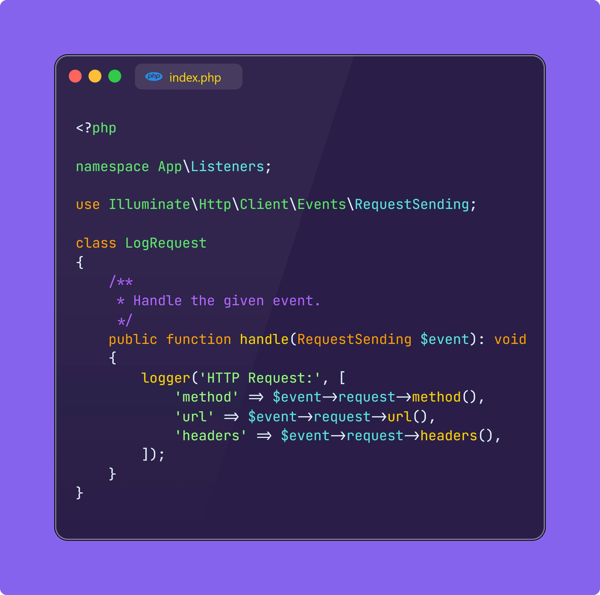
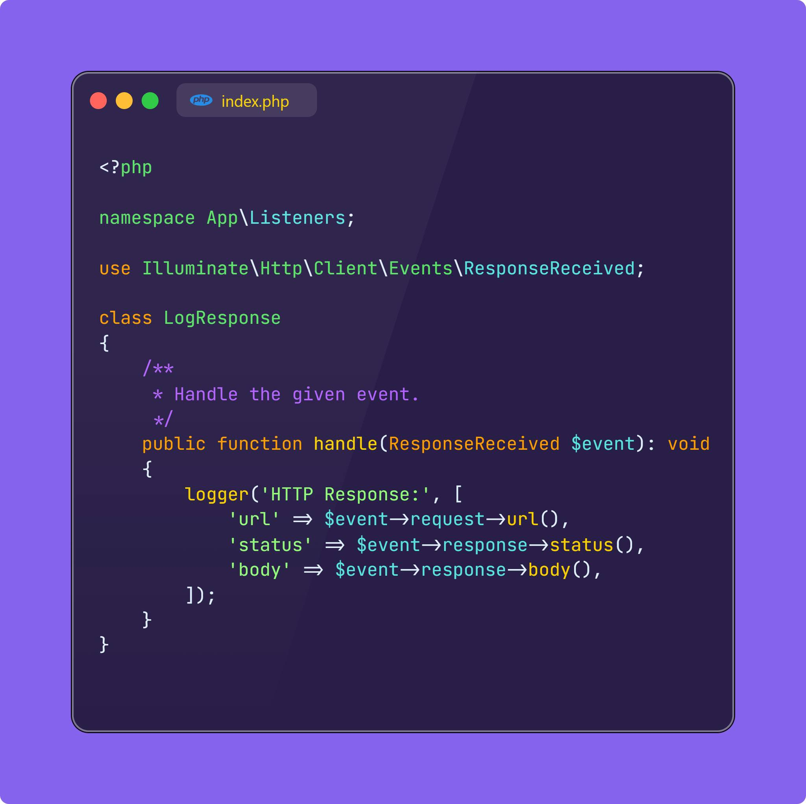
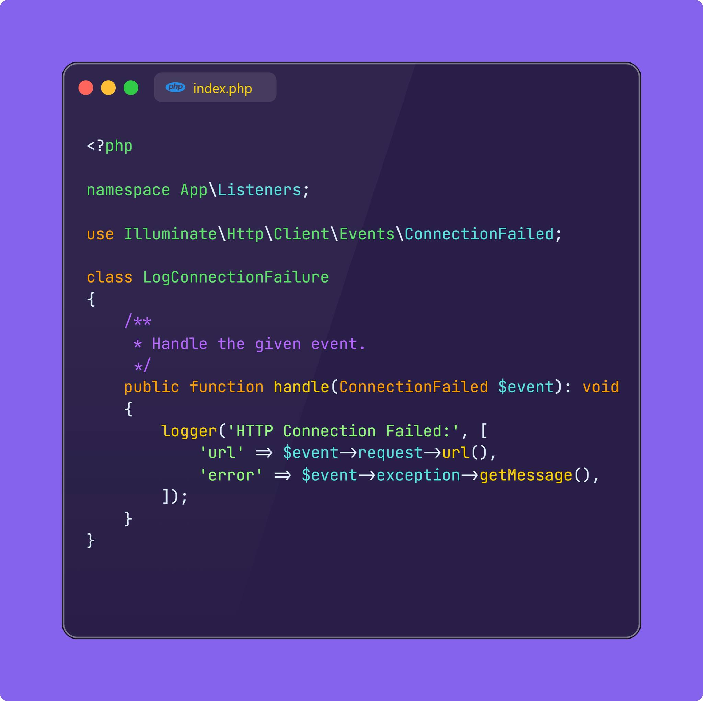

### Các sự kiện trong Laravel HTTP Client
Có một tính năng thú vị trong Facade Http của Laravel, đó là các sự kiện được hook vào lifecycle của quá trình bạn call các HTTP Request ra bên ngoài. Nếu như trước đây với Guzzle thì để hook vào các sự kiện tương tự sẽ hơi phức tạp, thì nhờ có HTTP Facade (wrap lại Guzzle) thì chúng ta có thể triển khai dễ dàng hơn nhiều. Đặc biệt việc sử dụng các event này áp dụng cho mọi chỗ sử dụng HTTP Facade, giúp bạn đỡ công đi sửa và tăng khả năng tái sử dụng code.
Laravel cung cấp các sự kiện chính:
+ Illuminate\Http\Client\Events\RequestSending: Được kích hoạt trước khi gửi một yêu cầu HTTP.
Thích hợp để theo dõi, ghi log hoặc kiểm tra yêu cầu trước khi gửi. Sự kiện này sẽ chỉ cung cấp Request.
+ Illuminate\Http\Client\Events\ResponseReceived: Được kích hoạt sau khi nhận được phản hồi từ yêu cầu HTTP.
Dùng để kiểm tra, ghi log hoặc xử lý phản hồi. Sự kiện này sẽ cung cấp cả Request và Response cho mình.
+ Illuminate\Http\Client\Events\ConnectionFailed: Được kích hoạt khi kết nối đến máy chủ từ xa thất bại.
Sự kiện này cung cấp Request và ConnectionException nên rất hữu ích để xử lý lỗi kết nối.
Điều này sẽ rất hữu ích trong một số use case cụ thể, khi bạn cần hook vào tất cả các lời gọi HTTP Client trong ứng dụng của bạn mà không cần sửa từng chỗ một. Một số use case mình đã thử và thấy khá hữu ích ví dụ như:
Bạn có thể sử dụng các sự kiện này để:
1 Theo dõi các request và response: Lưu log tất cả các request/response để debug.
Theo dõi các endpoint nào hay gặp lỗi.
2 Gửi thông báo khi lỗi xảy ra: Tích hợp với Slack, Email, hoặc một hệ thống cảnh báo để báo cáo các lỗi kết nối hoặc lỗi HTTP.
3 Phân tích performance: Đo thời gian phản hồi hoặc theo dõi tỷ lệ lỗi.
---
RequestSending là sự kiện được kích hoạt TRƯỚC khi request thực sự được gửi đi (bạn có thể tưởng tượng nó giống creating / saving / deleting của Event Model Eloquent). Với sự kiện này bạn có thể log lại các request, hoặc thậm chí throw exception và dừng việc request nếu check ra request không hợp lệ.

ResponseReceived là sự kiện được kích hoạt SAU KHI GỌI THÀNH CÔNG request. Với sự kiện này, chúng ta sẽ có cả request / response, từ đó có thể log lại toàn bộ request, hoặc kích hoạt thêm các luồng xử lý chung (thường là log / đo đếm / cảnh báo).

ConnectionFailed được kích hoạt khi lời gọi HTTP gặp lỗi. Bạn có thể tiến hành log lại dễ dàng request và exception để tiện điều tra, thông báo, đo đếm sau này.

