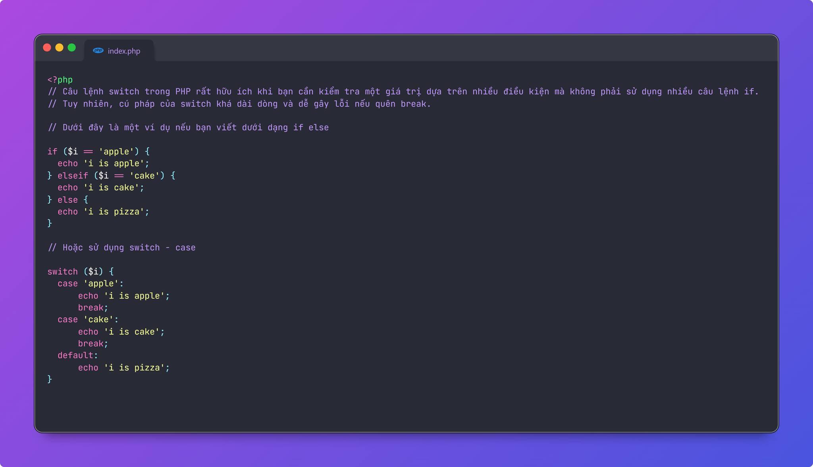
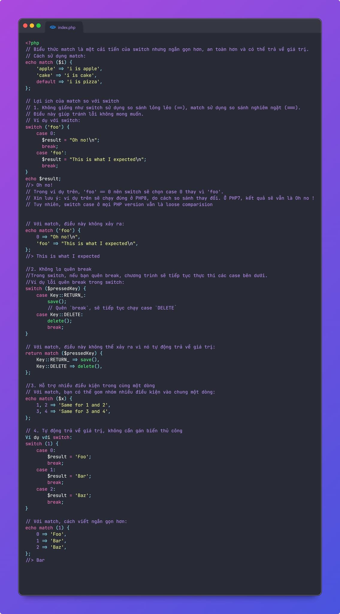

### Match
Cách viết if/else, switch / case truyền thống có một số vấn đề:
1. Code rườm rà dài dòng
2. switch / case bắt buộc cần break (nếu quên dễ lỗi). switch/case ko hỗ trợ strict compare qua === nên tiềm ẩn lỗi nếu bạn ko cẩn thận.

match tuy đơn giản, nhưng đem lại nhiều thứ khá thiết thực.
1. Không giống như switch sử dụng so sánh lỏng lẻo (==), match sử dụng so sánh nghiêm ngặt (===).
2. Không lo quên break.
3. Code gọn đẹp, hiện đại hơn.
