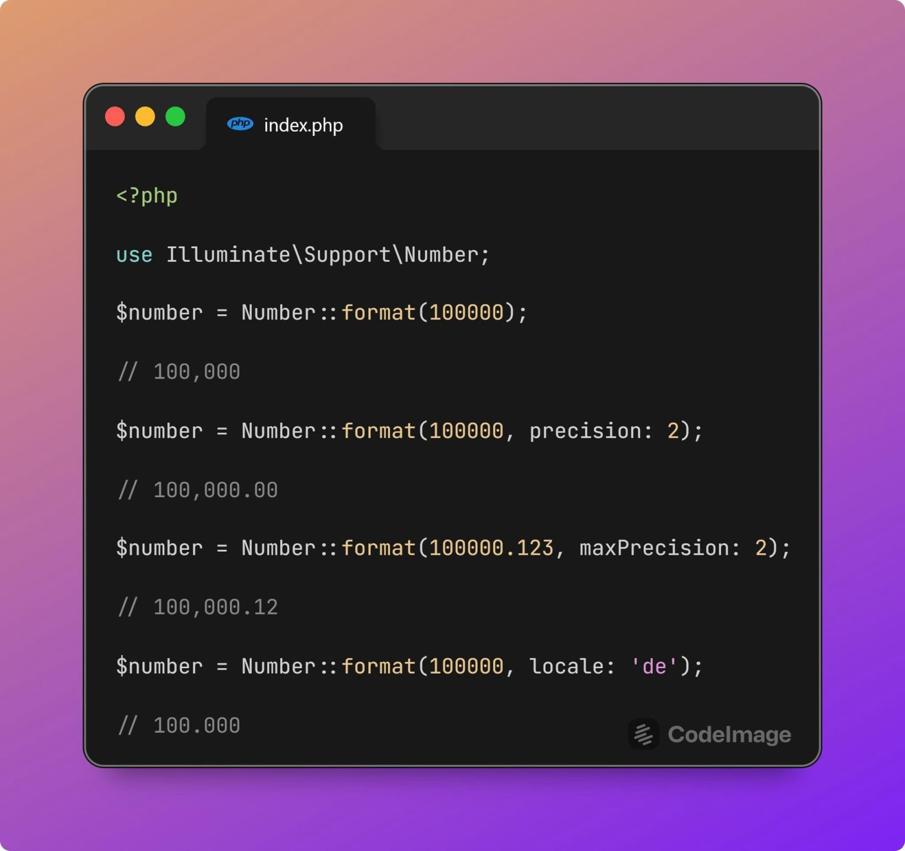
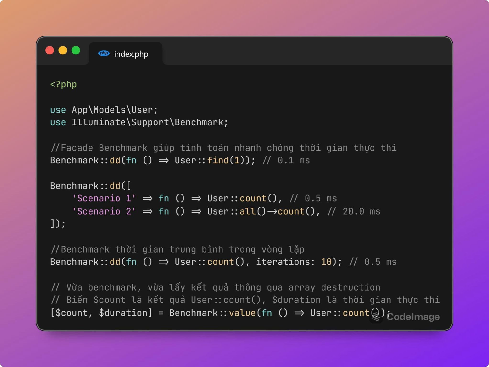
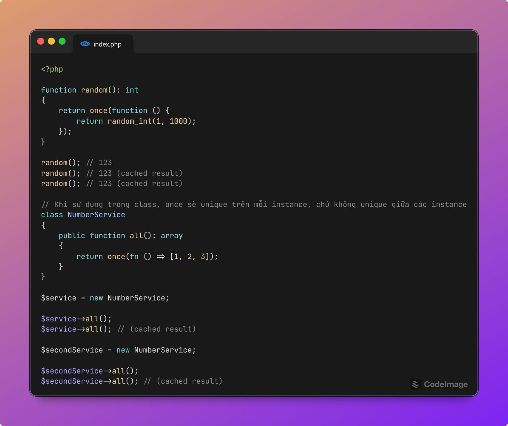
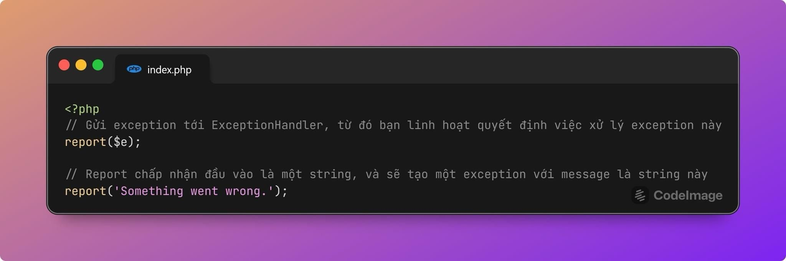
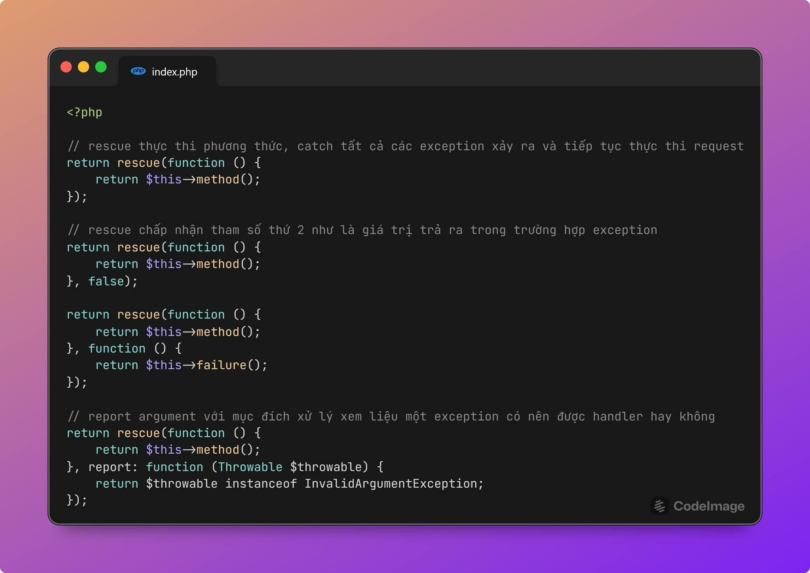
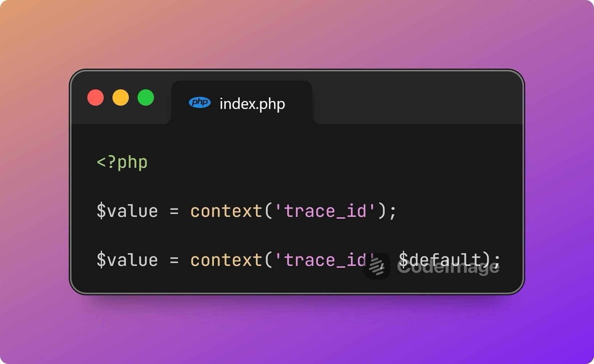
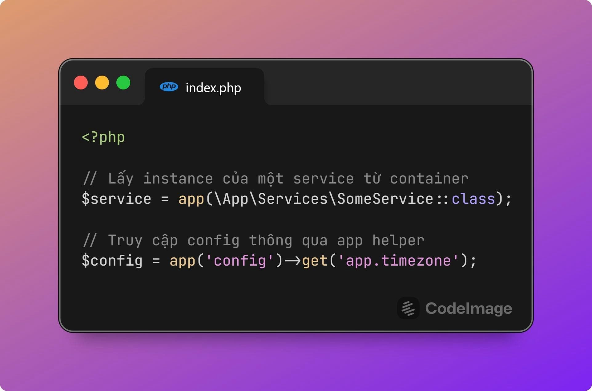
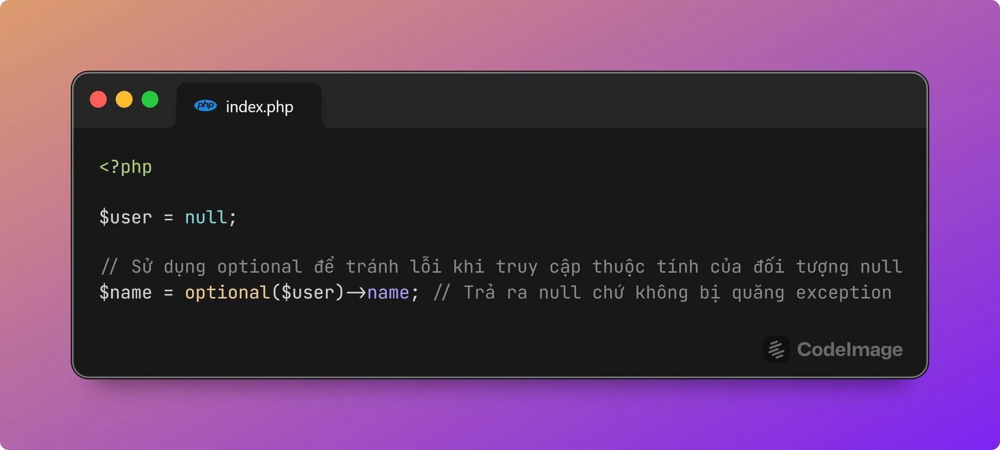
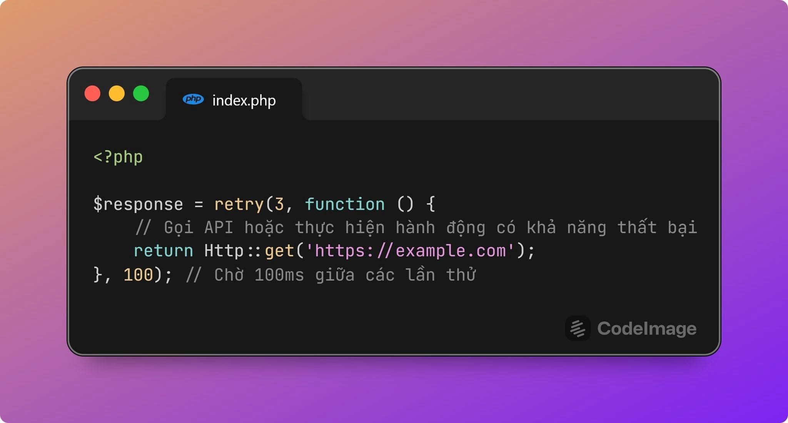
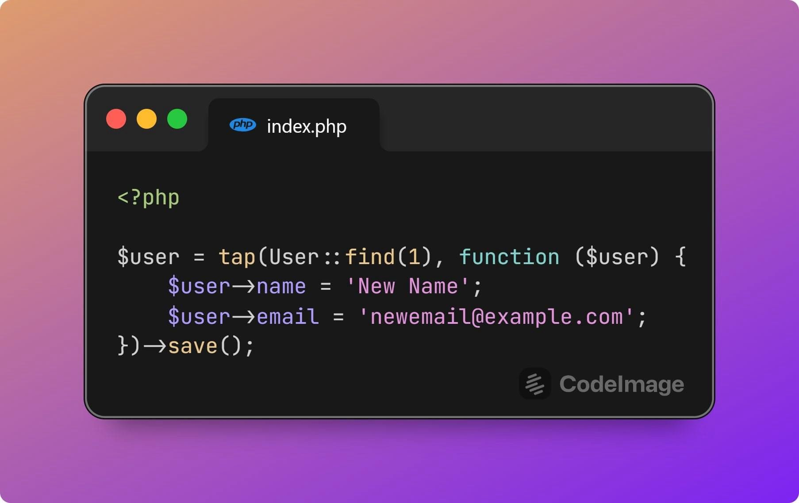

Một số hàm helper ít khi dùng trong laravel:
- Facade Number cho phép bạn format linh hoạt số theo nhiều phương thức khác nhau. Bên cạnh format số, facade này còn hỗ trợ những việc như quy đổi các giá trị, format text, làm tròn %, ... rất tiện lợi.

-Bạn muốn benchmark nhanh chóng đoạn code của mình chạy tốn bao nhiêu thời gian, thì facade benchmark chính là dành cho bạn. 

- once() là một helper thú vị khi bạn muốn một hàm chỉ chạy duy nhất một lần và cache lại kết quả.

- report cho phép bạn đẩy exception bất kỳ về Exception Handler. Điều này tiện ở chỗ bạn sẽ có nơi tập trung để xử lý exception như bắn lên sentry, bắn log, bắn telegram, slack, hoặc bỏ qua exception nào đó không muốn xử lý.

- rescue chạy một phương thức, catch toàn bộ exception và cho phép bạn linh hoạt xử lý trong trường hợp có lỗi xảy ra. Exception được chuyển về exceptionHandler như report nên bạn cũng không lo bị mất mát dữ liệu.
rescue sẽ khá tiện lợi khi bạn mong muốn đoạn code được thực thi mà không bị dừng khi có exception xảy ra và bớt đi những đoạn try-catch.

- context là helper rút gọn của Facade Context. Sẽ rất tiện khi bạn cần thêm các dữ liệu gắn với bối cảnh như trace_id, user, request, …
Context là tính năng mới xuất hiện gần đây nhưng mình thấy cũng khá hay.

***
- Helper app() trả về instance của application container, cho phép bạn truy cập các instance được bind trong container.
Trông có vẻ đơn giản, nhưng app() hay Container chính là trái tim và một trong những core concepts quan trọng của Laravel, giúp code của bạn linh hoạt hơn rất nhiều.

- Optional có thể coi là một phiên bản của Null Object Design Pattern. Với helper này, bạn có thể tự tin truy cập các thuộc tính của object nếu bạn không chắc chắn nó có null hay không, giúp code ngắn gọn an toàn hơn (Thay vì phải check điều kiện liên tục, hoặc sử dụng các toán tử như ??)

- data_get giúp bạn truy cập các phần tử mảng đa chiều qua dot notation (.) khá tiện dụng.

- retry là helper hay được dùng khi bắt đầu các lời gọi HTTP, tuy nhiên bạn cũng có thể áp dụng nó ở bất cứ tình huống nào bạn muốn retry lại trong code của mình.

- when(): Thực hiện hành động nếu điều kiện là true.
unless(): Thực hiện hành động nếu điều kiện là false.
Trông code có vẻ Laravel way hơn :)). Bạn có thể thấy các phương thức này trong Eloquent, nhưng có thể bạn chưa sử dụng nó thường xuyên ở ngoài.

- tap() cho phép bạn gọi một callback với đối tượng được truyền vào, thực hiện các thay đổi hoặc hành động, và sau đó trả về đối tượng đó. Trong một số tình huống, tap() sẽ giúp code của bạn ngắn gọn và dễ đọc hơn.

