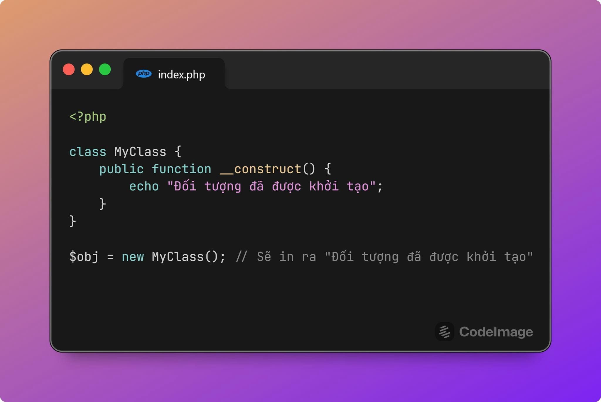
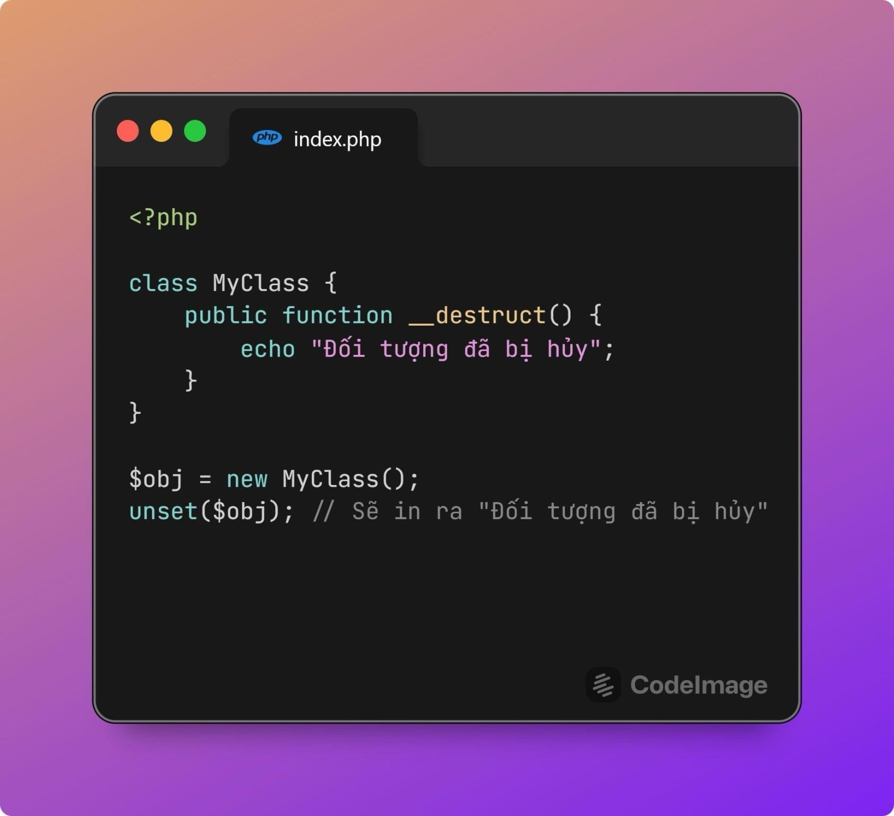
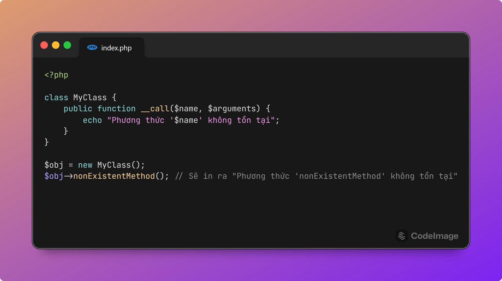
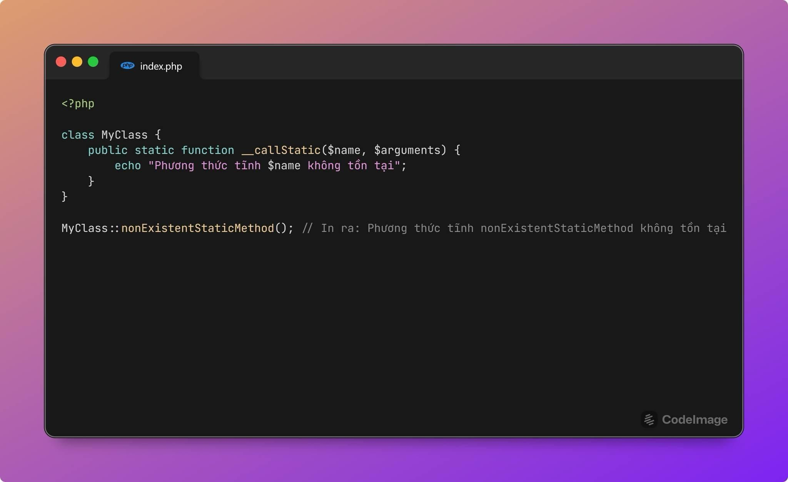
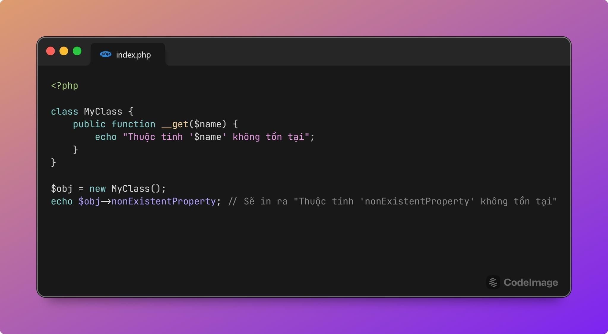
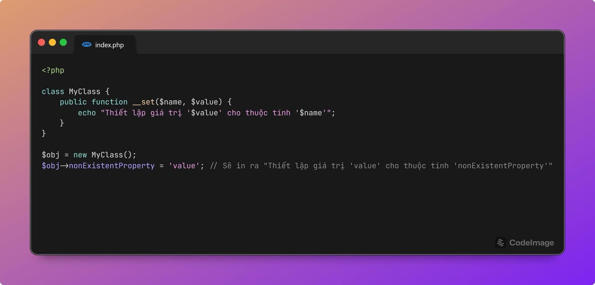
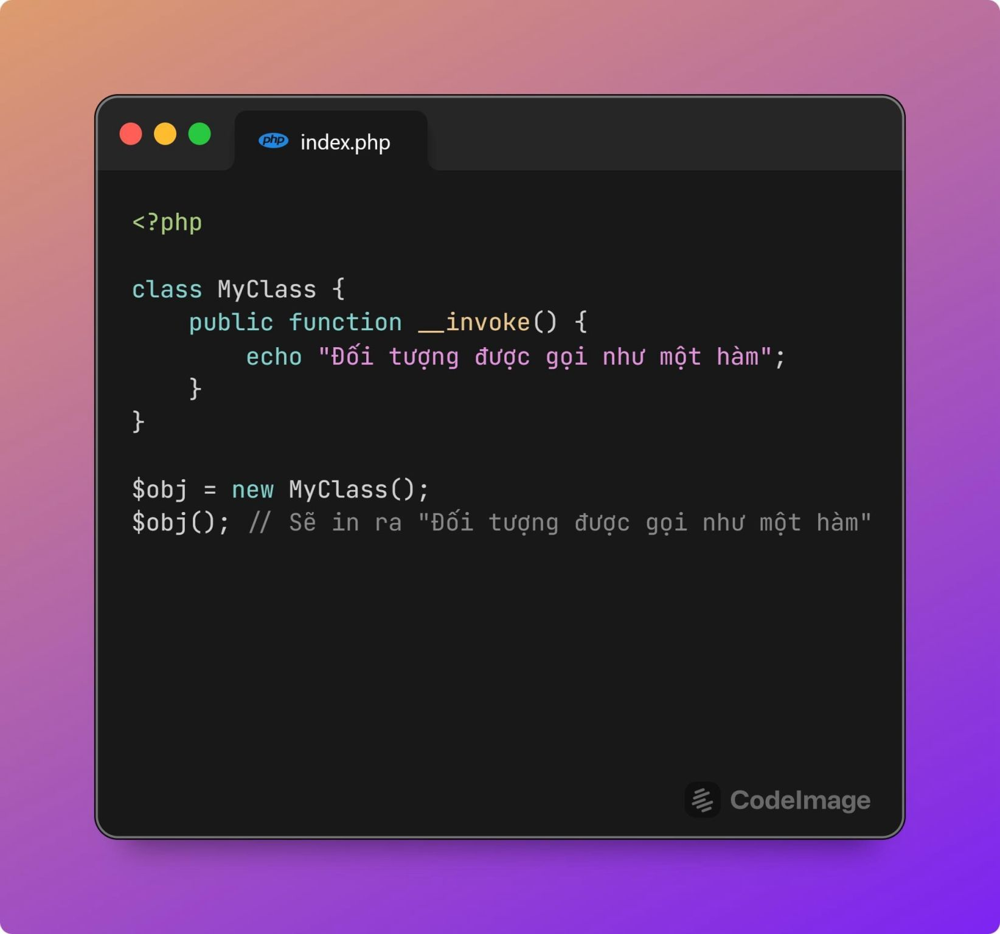
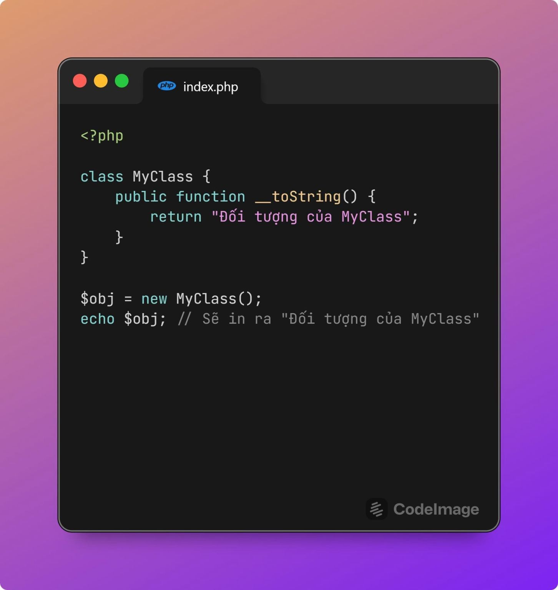
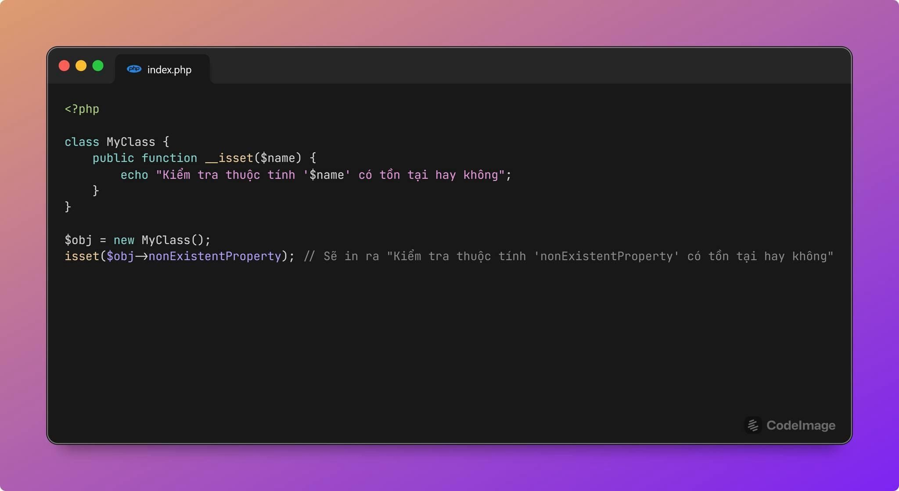

### Magic method trong PHP:
- __construct(): Phương thức này được gọi khi một đối tượng được tạo ra. Quá quen thuộc rồi ae nhỉ, chúng ta đều sử dụng nó hàng ngày, đặc biệt là với Dependency Injection.

- __destruct(): Phương thức này được gọi khi đối tượng bị hủy.

- __call($name, $arguments): Phương thức này được gọi khi gọi một phương thức không tồn tại hoặc không thể truy cập. Các tính năng như macro hay mixin của Laravel được xây dựng dựa trên __call.

- __callStatic($name, $arguments): Tương tự như __call(), nhưng dành cho các phương thức static. Laravel Facade được xây dựng dựa trên magic method này.

- __get($name): Phương thức này được gọi khi truy cập một thuộc tính không tồn tại hoặc không thể truy cập.

- __set($name, $value): Phương thức này được gọi khi thiết lập giá trị cho một thuộc tính không tồn tại hoặc không thể truy cập.

- __invoke(): Phương thức này được gọi khi đối tượng được gọi như một hàm. Nếu bạn biết tới Pattern Single Action Controller trong Laravel, thì __invoke là phương thức được thường xuyên sử dụng.

- __toString(): Phương thức này được gọi khi đối tượng được chuyển đổi thành chuỗi. Khá phù hợp khi bạn cần serialize đối tượng để trả ra cho client chẳng hạn.

- __isset($name): Phương thức này được gọi khi sử dụng hàm isset() hoặc empty() trên một thuộc tính không tồn tại hoặc không thể truy cập.

- __unset($name): Phương thức này được gọi khi sử dụng hàm unset() trên một thuộc tính không tồn tại hoặc không thể truy cập.
