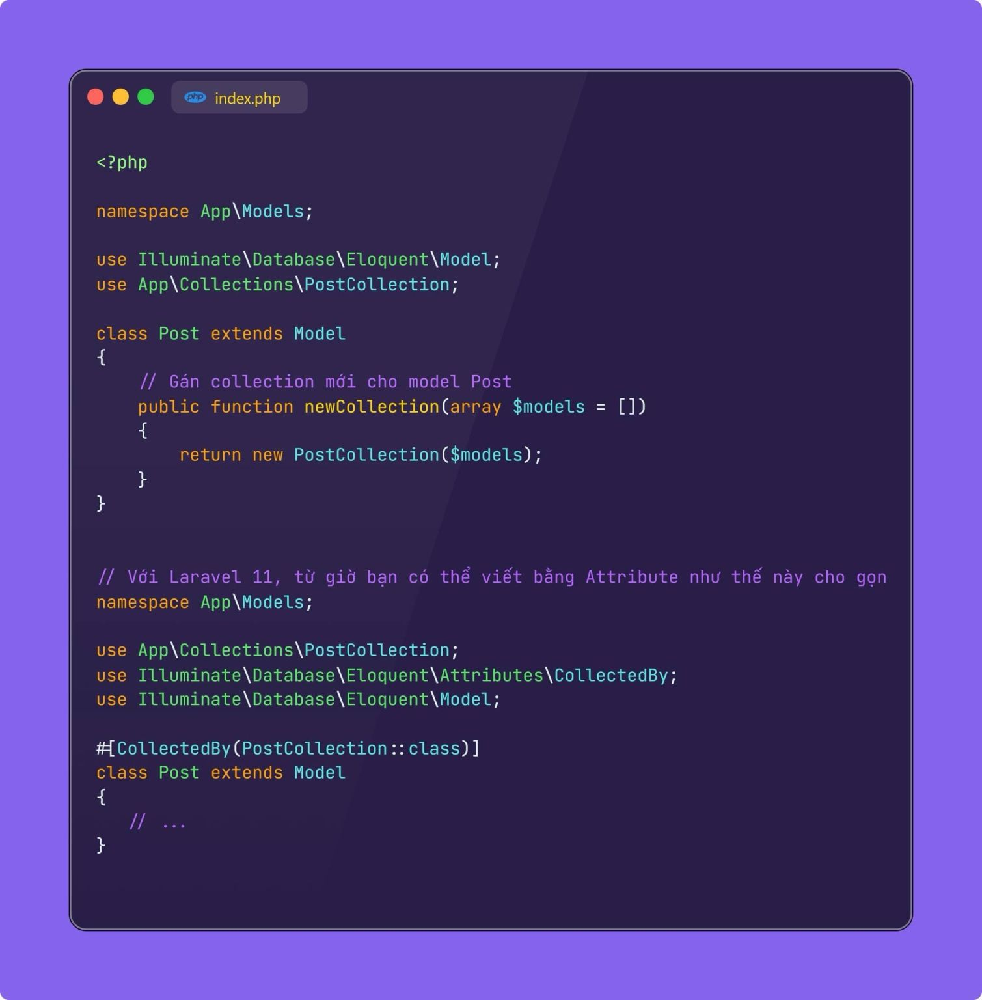
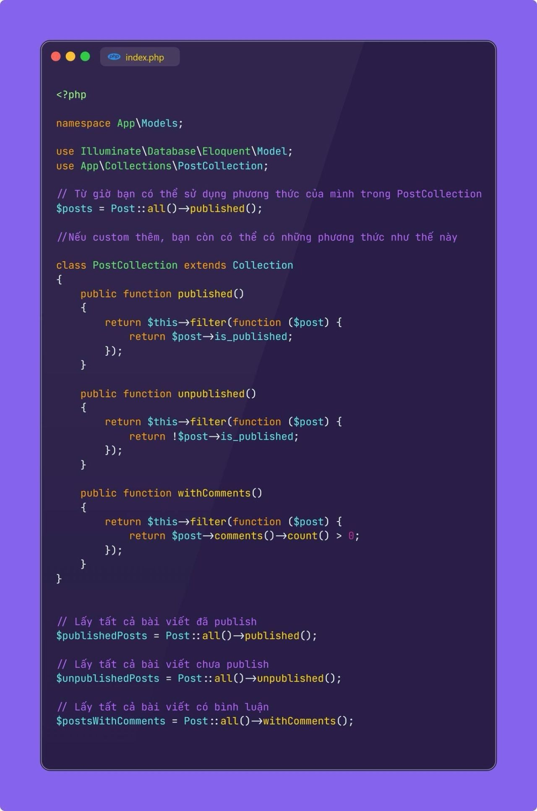

### Các bạn chắc đã nhiều lần nghe tới Custom Query
Builder trong Laravel. Hôm nay cùng mình ngó thêm một tính năng cũng rất thú vị tương tự, là
Custom Eloquent Collection.
Mặc định, kết quả truy vấn từ Eloquent sẽ là một instance của
```Illuminate (Database|Eloquent\Collection``` (nếu kết quả là danh sách). Về cơ bản, Collection của
Laravel đã rất mạnh mẽ với hàng chục các helper hỗ trợ làm việc với dữ liệu dạng list. Tuy nhiên, trong nhiều trường hợp, bạn sẽ muốn custom
Collection này để thêm thắt các phương thức phù hợp cho dự án, cũng như để tránh lặp đi lặp lại các đoạn code xử lý nữa. Tất nhiên là Laravel cho phép bạn làm điều này, tương tự như Custom Query Builder
- Đầu tiên, chúng ta sẽ cần kế thừa lại Illuminate\Database\Eloquent\Collection và định nghĩa các phương thức chúng ta mong muốn.

- Tiếp theo, bạn sẽ cần áp dụng Custom Collection cho model bằng cách override phương thức newCollection() của model đó.

- Gần đây Laravel 11 đã cung cấp thêm một cách nữa để bạn có thể đăng ký Custom Collection, đó là thông qua Attribute CollectedBy 
Tips: Nếu bạn muốn dùng CustomCollection cho nhiều Model, hãy tạo một class cha (có sử dụng Custom Collection), và các model của bạn extends từ đó là được nhé.

- Với cách triển khai này, mỗi lần bạn lấy các bản ghi từ model Post, Laravel sẽ trả về một instance của PostCollection thay vì collection mặc định. Từ giờ, bạn có thể gọi phương thức này trong kết quả trả về một cách rất tiện lợi như hình.
Những lợi ích của Custom Query Collection hoàn toàn giống Custom Query Builder, giúp bạn tránh lặp đi lặp lại code, dễ dàng áp dụng cho nhiều model khác nhau, tập trung logic tại một chỗ. Đây là hai tính năng rất hay.