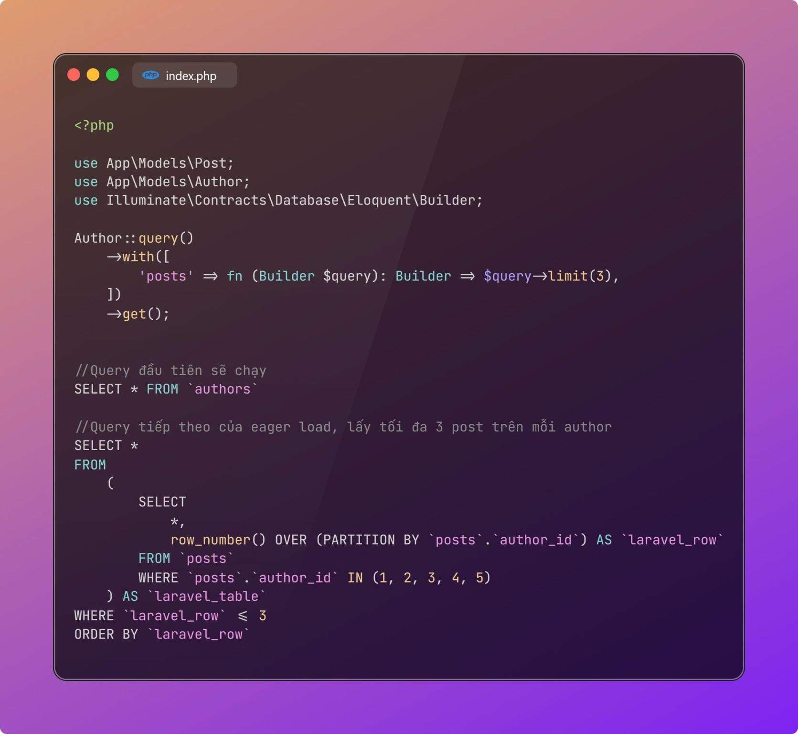

Thi thoảng, khi làm việc với Laravel, bạn sẽ cần limit lại số lượng bản ghi khi eager loading với with. Trước Laravel 11, hầu như không có cách nào nhanh gọn để thực hiện việc này cả. Bạn sẽ cần cài thêm một package bên ngoài. Tuy nhiên, với Laravel 11, tính năng này đã được merge vào core framework.

