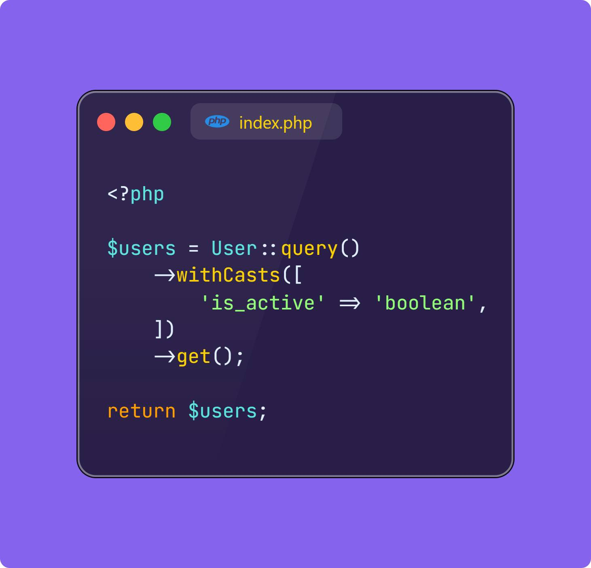
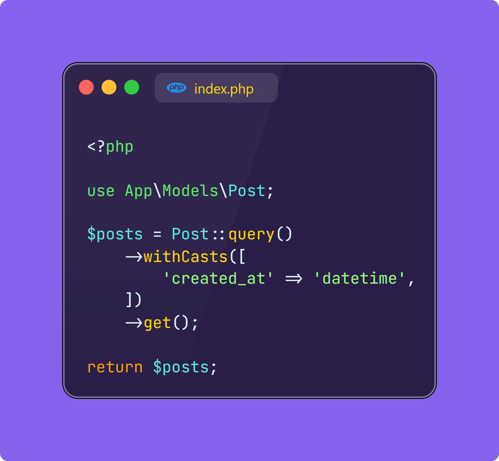
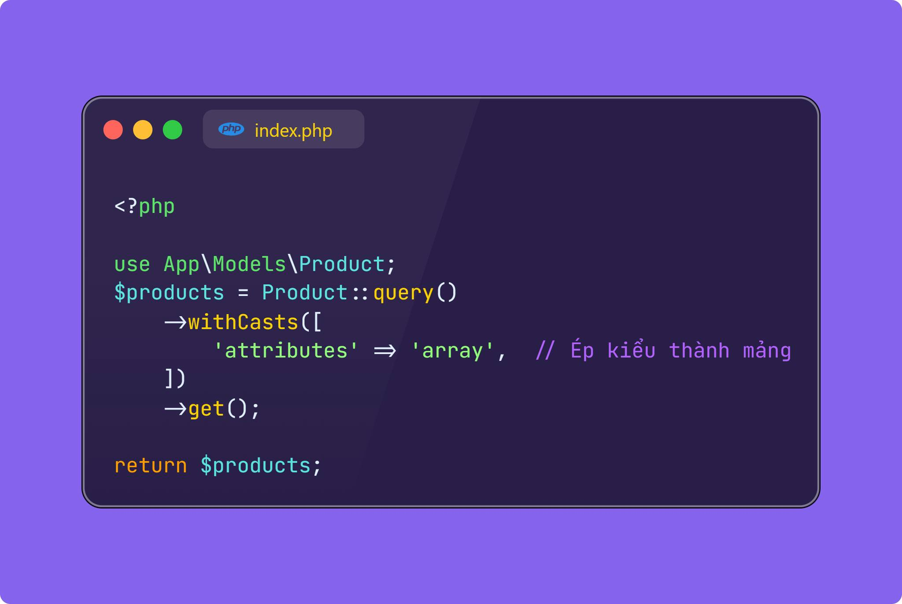

### Ép kiểu dữ liệu Eloquent với Query Time Casting
Việc ép kiểu dữ liệu model trong Laravel với mình rất tiện, vì mình thích sự chặt chẽ của kiểu dữ liệu, đặc biệt là vụ convert tự động sang array hay Carbon tiện lợi. Tuy nhiên thi thoảng gặp tình huống trớ trêu là mình ép luôn từ model, có thể gây impact đến những đoạn code khác đã được viết trước đó.
Trong Laravel, từ phiên bản 8.40 trở đi, bạn có thể sử dụng phương thức withCasts() để ép kiểu dữ liệu tại thời điểm truy vấn mà không cần phải định nghĩa $casts trong model. Điều này giúp bạn linh hoạt hơn khi cần ép kiểu tạm thời cho các thuộc tính của model trong một truy vấn cụ thể.
Phương thức withCasts() cho phép bạn định nghĩa cách các thuộc tính sẽ được chuyển đổi chỉ trong một truy vấn duy nhất, mà không cần phải ép kiểu toàn bộ model mỗi khi sử dụng.
Cách sử dụng withCasts():
```
    Model::query()->withCasts([
    'field_name' => 'cast_type',
    ])->get();
```
field_name: Tên của cột bạn muốn ép kiểu.
cast_type: Kiểu dữ liệu mà bạn muốn cột đó được ép kiểu, tương tự như $casts trong model.
---
Giả sử bạn có một bảng users với cột is_active và bạn muốn ép kiểu cột này thành boolean tại thời điểm truy vấn. Trong kết quả, cột is_active sẽ được chuyển đổi thành giá trị boolean (true hoặc false), thay vì số 0 hoặc 1 từ cơ sở dữ liệu.


Giả sử bạn có một bảng posts với cột created_at, và bạn muốn ép kiểu created_at thành kiểu Carbon chỉ trong một truy vấn nhất định. Với cách này, cột created_at sẽ được trả về như một instance của Carbon\Carbon, cho phép bạn sử dụng các phương thức ngày giờ mạnh mẽ của Carbon.


Nếu bạn có một bảng products với cột attributes lưu trữ dưới dạng JSON, bạn có thể ép kiểu cột này thành mảng hoặc JSON Object khi truy vấn. Với cách này, cột attributes sẽ tự động được chuyển đổi thành một mảng khi bạn truy vấn dữ liệu, cho phép bạn thao tác với mảng ngay lập tức.
