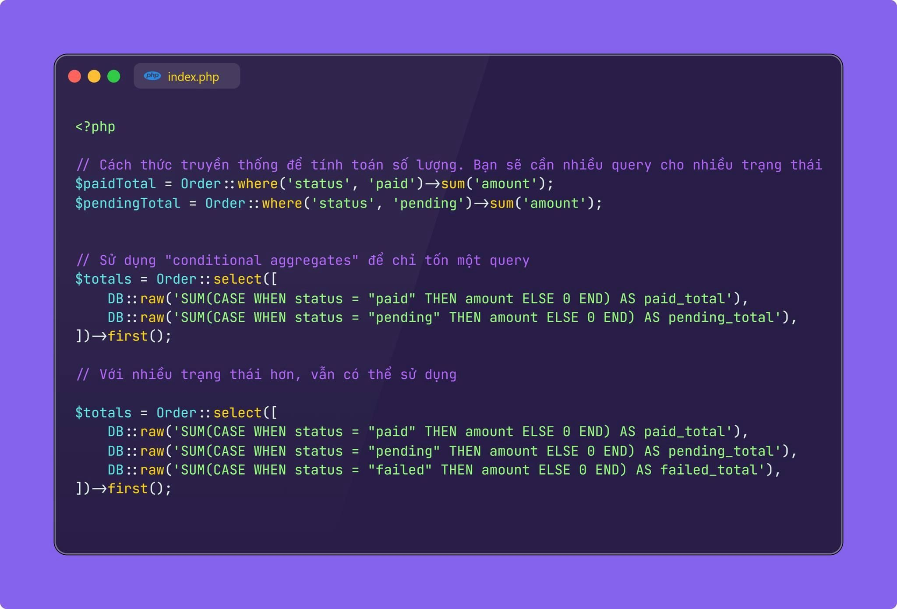

Trong một số use case thực tế, bạn có thể sẽ cần chạy lệnh sum() hoặc các lệnh aggreate theo một số điều kiện nhất định và hiển thị đồng thời ra view.
Hãy ví dụ: Mình cần sum amount các đơn hàng
(Order) ở trạng thái "PAID" (Đã thanh toán) và trạng thái "PENDING" (Chờ thanh toán). Để thực thi những yêu cầu dạng này, bạn sẽ cần nhiều hơn một query sum(). Có một cách khác, là có thể sử dụng "conditional aggregates" nhằm tính toán theo điều kiện dựa trên chỉ một query duy nhất.
Cách đầu tiên lợi thế là đơn giản, dễ triển khai, nhưng sẽ nhiều query. Cách thứ hai sẽ giảm được lượng truy vấn, nhưng code có vẻ là "không đẹp" và sẽ phức tạp hơn khi code.
PS nhỏ: Bỏ qua vụ trường status có được index hay không nhé ae, cứ coi như các câu truy vẫn này chạy đều rất nhanh nhé

