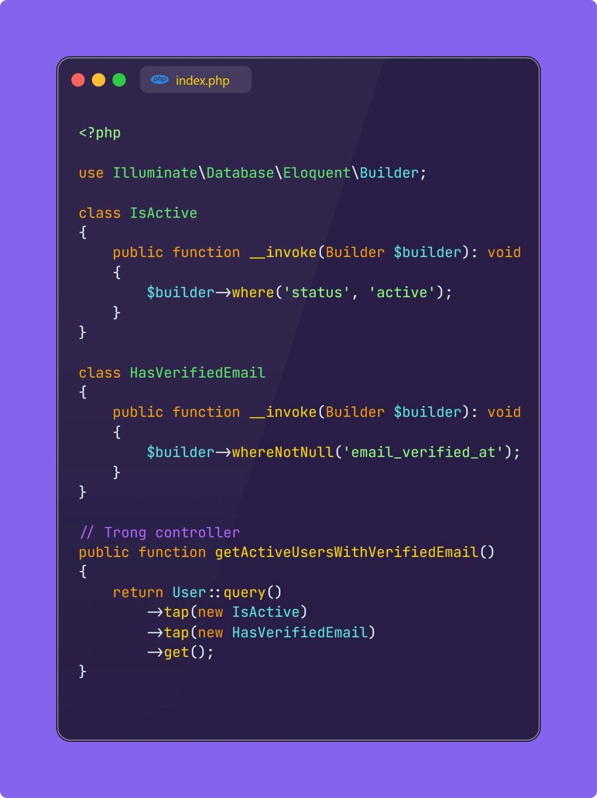
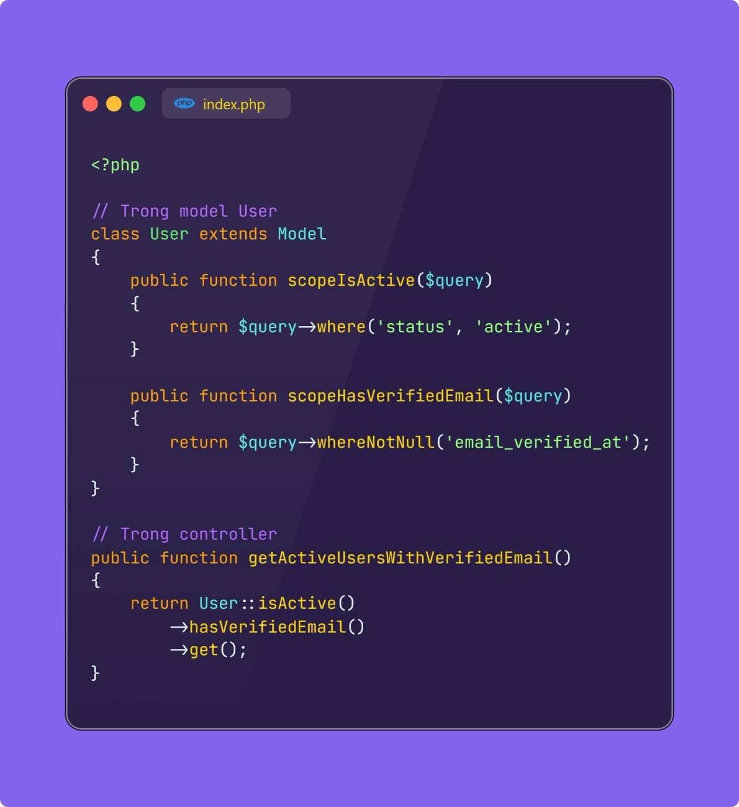

Tappable Scope, một cách viết Scope không nhiều người sử dụng.
Ae chắc không xa lạ gì với khái niệm Scope khi làm việc với Eloquent trong Laravel. Scope khá là tiện lợi, nó giúp mình tái sử dụng các điều kiện linh hoạt mà không cần phải define lại code. Nhưng có một cái khá là không thoải mái khi mình dùng scope, đó là IDE gặp khó khăn khi auto suggest scope, khá là bất tiện. Chưa kể là nhiều khi, scope được viết hết vào một file model, nhiều khi làm file của mình phình to lên, khó kiểm soát. Chưa kể nữa là một số Model của mình có những scope rất giống nhau, ví dụ scopeIsActive chẳng hạn. Mình muốn chỉ viết một scope và có thể apply cho nhiều model cùng lúc thay vì phải copy các scope giống nhau giữa các model. 

Nếu ae cũng gặp những khó khăn giống như mình, mọi người có thể thử Tappable Scope. Điều thú vị là, cách viết này không đượcc ghi trong Document, nên sẽ không nhiều người biết tới. Những lợi ích đáng kể của Tappable Scope có thể kể tới như: suggestion tốt hơn, dễ dàng chia nhỏ nghiệp vụ khi cần thiết, đảm bảo tính tái sử dụng cho nhiều Model. Nếu phát triển thêm, chúng ta thấy hao hao nét của Specification Design Pattern trong cách viết này.

Với Tappable Scope, mỗi Scope được tách thành một class riêng biệt và kích hoạt qua magic method __invoke. Điều này đem đến một số lợi ích như:
1. IDE dễ dàng suggest code
2. Chia nhỏ được logic nghiệp vụ các scope riêng biệt thay vì viết chung hết vào model
3. Tái sử dụng được scope cho các model khác nhau

