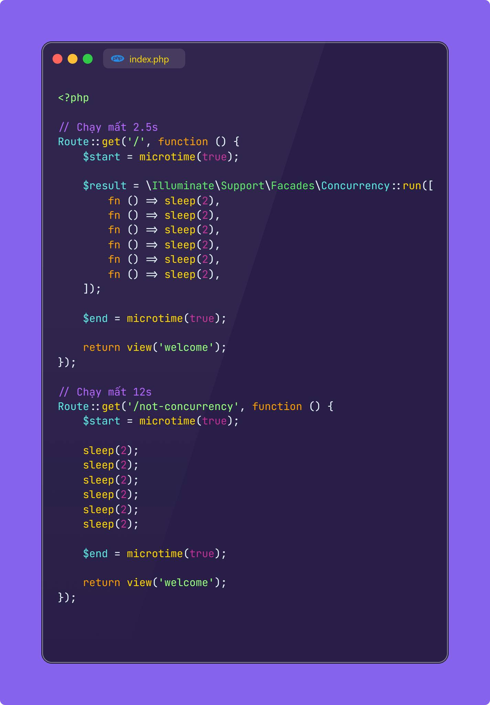
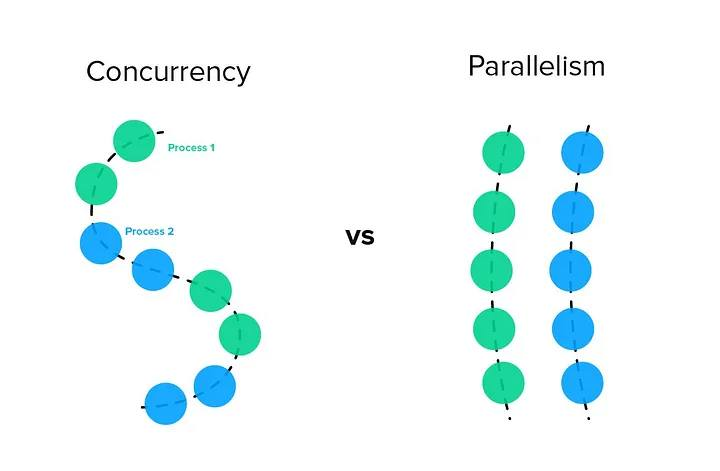
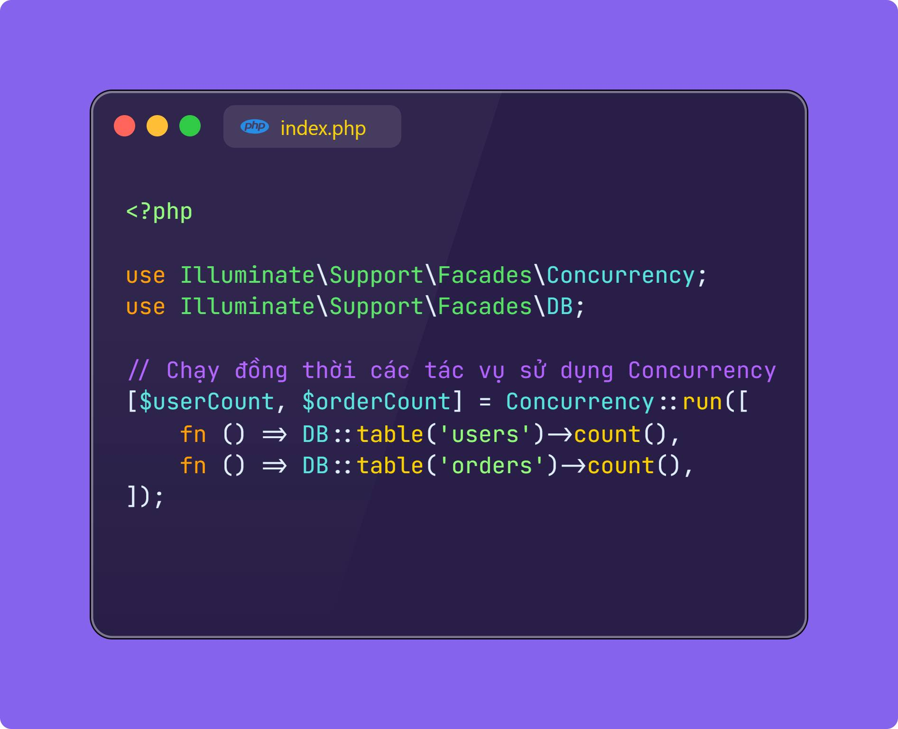
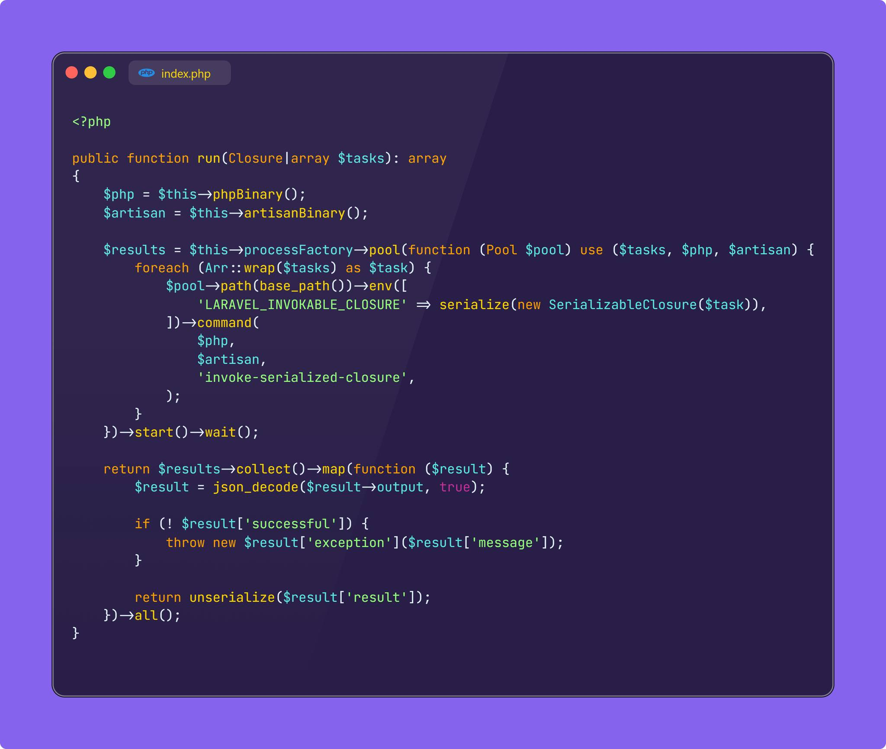
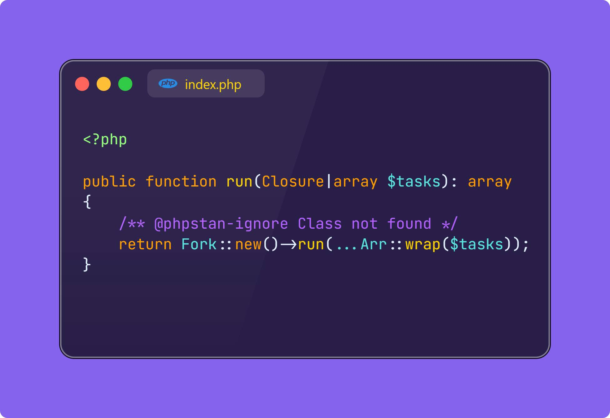
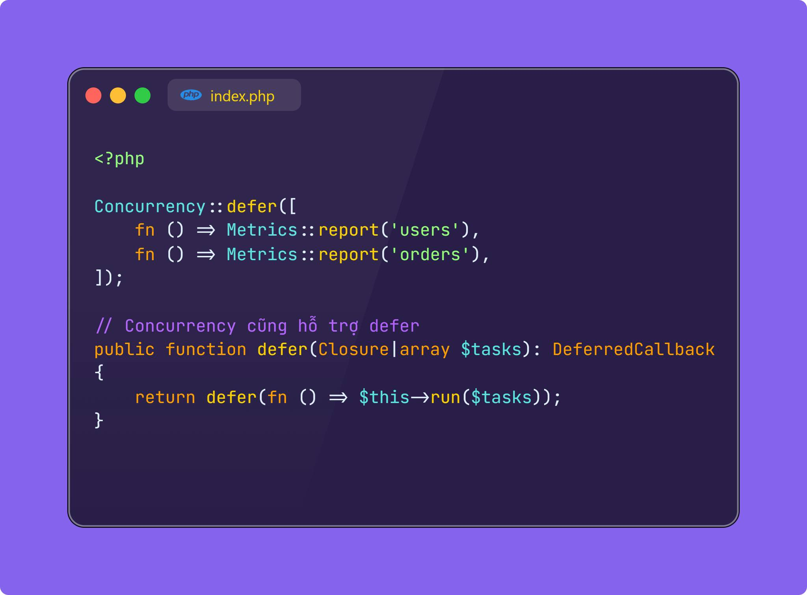

- "Concurrency", hay còn gọi là xử lý đồng thời, cho phép Laravel có thể chạy nhiều tác vụ cùng một lúc mà không phải chờ đợi lẫn nhau. Khác với nguyên tắc xử lý tuần tự thông thường, với Concurrency, ứng dụng có thể xử lý cùng lúc nhiều đầu việc hơn với thời gian ngắn hơn, từ đó tối ưu được Performance lên rất nhiều. Trước đây để thực thi điều này với Laravel, thông thường phải cài thêm Swoole / Ampp, hoặc là sử dụng Pool HTTP, khá bất tiện. Facade mới này của Laravel cho phép bạn thực thi Concurrency mà không cần cài đặt thêm thư viện / extension nào (Do tận dụng Pool ProcessComponent từ Symfony)
- Bạn đừng nhầm lẫn giữa "Concurrency" (đồng thời) và Parallelism (song song) nhé, vì đây là hai khái niệm khác biệt, mặc dù đều để mô tả cách ứng dụng xử lý các tiến trình cùng một lúc.
- Trước khi nói về Facade này, ta cần hiểu một cách đơn giản về "Concurrency". Hãy tưởng tượng là buổi sáng đến công ty, và mình cần phải pha một tách cafe, và nướng lại ổ bánh mì mới mua đầu hẻm. Nếu là cách xử lý đồng bộ ("Sync") thông thường, bạn sẽ cần đợi máy pha cafe pha xong, rồi mới chạy qua nướng chiếc bánh mì của mình. Khi đó:
- Tổng thời gian chờ đợi = Thời gian pha cafe + Thời gian nướng bánh.
Với "Concurrency", bạn sẽ bắt đầu pha tách cafe của mình. Trong quá trình đợi máy pha cafe, bạn đang "rảnh", và mình sẽ nướng bánh luôn. Nướng bánh xong, mình lại quay lại coi cafe xong chưa, nếu chưa xong, ta lại quay qua check lò vi sóng. Quay qua quay lại hồi (mà trên các tài liệu gọi là "switching context"), bạn sẽ làm được cả hai việc trên một cách "đồng thời" (thực tế là ta tận dụng thời gian rảnh là chính chứ không thực sự là "song song", đây cũng là điều mình nhấn mạnh sự khác biệt bên trên). Khi đó:
Tổng thời gian chờ đợi = Thời gian của công việc nào lâu hơn (pha cafe hoặc nướng bánh) và nó rõ ràng là sẽ nhanh hơn cách thực thi bên trên, do chúng ta tối ưu được thời gian chờ đợi (Hay bạn còn nghe ở đâu đó thuật ngữ Non Blocking I/O).
Okay, giờ thì chúng ta sẽ đi vào phân tích ba driver chính tạo nên Concurrency, đó là "process", "fork", "sync" nhé. Facade này khá hay, nếu ae đang xài Laravel 11 thì nên tận dụng xem use case nào phù hợp nhé. 

***

- Để bạn dễ hình dung hơn, đây là một ví dụ mình viết thử.
Với concurrency, 6 tác vụ 2s (được mô tả qua sleep(2s)) sẽ chỉ mất 2.5s (vì chúng chạy "đồng thời" với nhau)
Với chạy tuần tự, sẽ mất 12s. Concurrency sẽ hỗ trợ các long-running task của bạn có hiệu suất tốt hơn. Tuy nhiên thì ae cũng đừng nên lạm dụng quá nhé, vì tạo ra quá nhiều tiến trình song song cũng có thể gây áp lực lên hệ thống đó

- Thêm một hình nữa để bạn dễ hiểu hơn về Concurrency. Các tiến trình sẽ được luân phiên nhau thực hiện một cách phù hợp để tối ưu thời gian chờ đợi, giúp chúng ta cải thiện performance của hệ thống. Nó không phải là "song song" thực sự

- Như hình bên đây, bạn có thể hiểu Concurrency sẽ chạy đồng thời cả 2 câu truy vấn. Nôm na, tức là trong khi đợi users count trả về kết quả, sẽ chạy orders count luôn (không cần chờ đợi tuần tự)
Điểm đặc biệt là Concurrency lần này đã hỗ trợ môi trường PHP-FPM (trước đây nó chỉ xuất hiện trên Octane Swoole).

- Concurrency hiện tại hỗ trợ 3 driver: Bạn có thể lựa chọn driver thông qua lệnh Concurreny::driver()->run(...).
Driver mặc định là "process"
Laravel sẽ đẩy các tiến trình xuống artisan command (php artisan invoke-serialized-closure). Các lệnh artisan này sẽ chạy song song trước khi gửi trả lại kết quả về cho parent Process, sau đó trả kết quả cho client. Để làm được điều này, Laravel tận dụng Pool Process từ Symfony Process Component.
Nếu bạn thấy vẫn hơi khó hiểu, bạn chỉ cần hiểu đơn giản rằng, Laravel sẽ tạo ra nhiều tiến trình khác nhau để xử lý đồng thời các tác vụ. Khi tất cả các tác vụ chạy xong, Laravel sẽ nhận kết quả và trả về. Hiểu đơn giản hơn nữa, thì nó gần như bạn chạy Job Queue, nhưng ở mức tiến trình và nhận kết quả ngay, thay vì chạy ở luồng riêng như Queue.

- Driver tiếp theo là fork
Fork được base trên package Spatie Fork, lõi được xây trên extension pnctl của PHP
Bản chất cũng là fork ra các Process để xử lý, nhưng fork có performance tốt hơn driver, tuy nhiên nó chỉ support môi trường CLI (Do PHP-FPM không cho phép tạo thêm các process). Điều này có nghĩa là bạn không thể dùng driver fork này cho môi trường web được.

- Driver cuối cùng là sync
Sync giúp concurrency chạy tuần tự (không song song) phù hợp môi trường testing để bạn tiện kiểm tra

- Concurrency cũng hỗ trợ luôn defer, cho phép bạn chạy các task song song và sau khi đã trả kết quả về cho client, giúp tối ưu thêm nữa hiệu quả của defer

