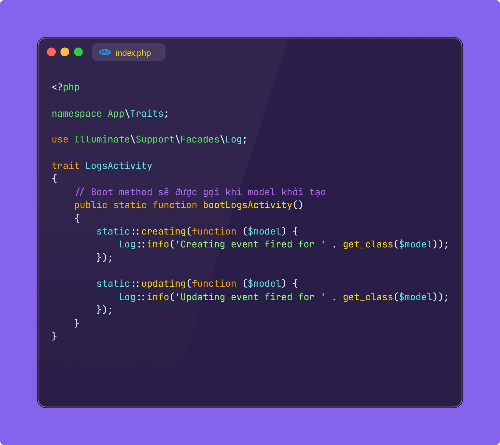
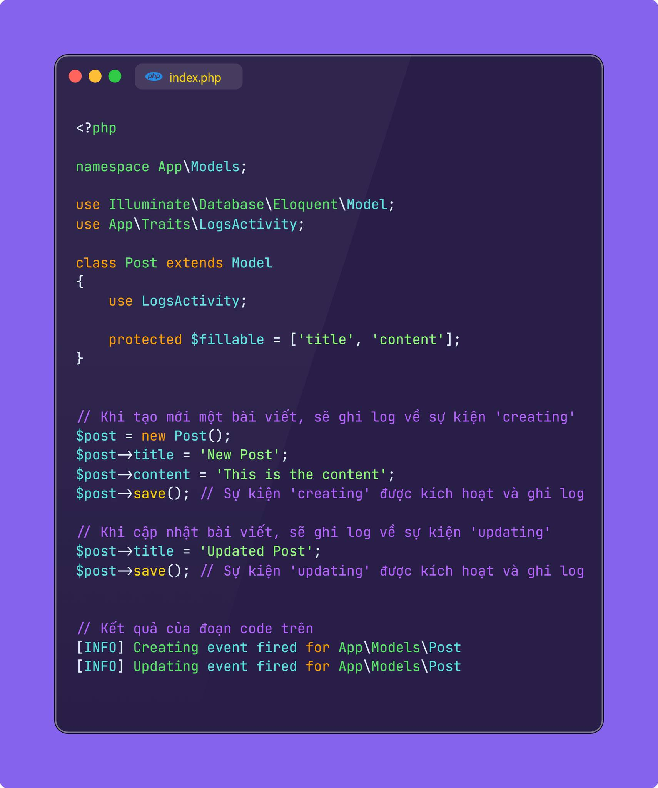

### Boot Eloquent Traits
Trong Laravel, bạn có thể sử dụng Eloquent Traits để chia sẻ logic chung giữa các model. Khi sử dụng traits với các model, đôi khi bạn cần sử dụng các hook để thực hiện logic khi model được khởi tạo hoặc trong các sự kiện như tạo, cập nhật, xóa. Để thực hiện điều này, bạn có thể sử dụng Boot Eloquent Traits.
Laravel hỗ trợ một cách cụ thể để thêm logic khởi tạo (booting) cho các traits bằng cách định nghĩa một phương thức với tên bắt đầu bằng boot và kết thúc bằng tên của trait.
Điều này sẽ khá hữu ích trong trường hợp bạn muốn hook các logic giống nhau vào lifecycle của model như created, creating, ....
Khi nào nên sử dụng Boot Eloquent Traits:
- Khi bạn muốn chia sẻ logic khởi tạo giữa nhiều model.
- Khi bạn muốn thêm các hook để xử lý các sự kiện như creating, updating, deleting trong nhiều model mà không cần viết đi viết lại trong các Model.
- Đặc biệt hữu ích cho các tình huống như ghi log, cập nhật thời gian, cập nhật giá trị các thuộc tính, hay kiểm tra dữ liệu trước khi lưu.

---
Khi sử dụng một trait trong một model Eloquent, nếu trait có phương thức boot[TênTrait](), Laravel sẽ tự động gọi nó khi model khởi tạo.
Giả sử bạn có một trait để ghi log mỗi khi một model được tạo hoặc cập nhật.
Tạo Trait LogsActivity

Sử dụng Trait trong Model Post.
Khi nào nên sử dụng boot trong trait:
1. Khi bạn muốn chia sẻ logic khởi tạo giữa nhiều model.
2. Khi bạn muốn thêm các hook để xử lý các sự kiện như creating, updating, deleting trong nhiều model mà không cần viết đi viết lại trong các Model.
3. Đặc biệt hữu ích cho các tình huống như ghi log, cập nhật thời gian, cập nhật giá trị các thuộc tính, hay kiểm tra dữ liệu trước khi lưu.

